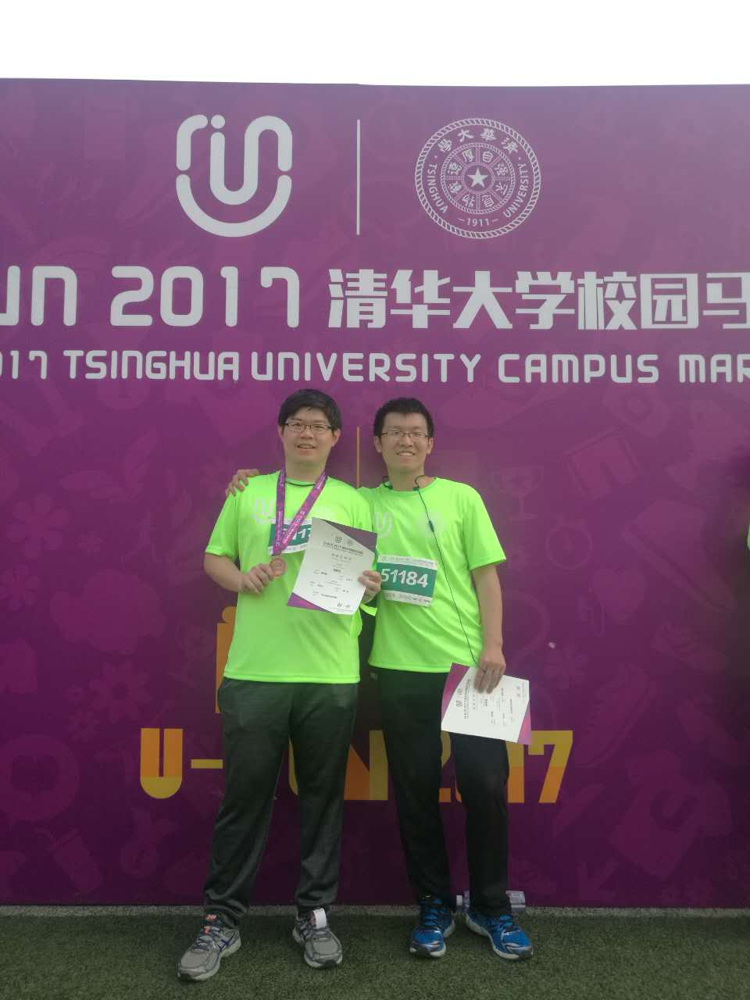

# Week15-16

这两周上火，感觉是开题那时候憋的气现在都返上来了。火辣辣的。调养两天好很多。还是说几个有趣的事情。

* 老师上课

  老师的职责是什么？我一直认为是教书育人。但是清华的老师分系列：教研和研究。差别就是前者负责教学和研究，而后者只有研究任务。当然，前者的地位高很多，可以带博士生，待遇也高很多。至少听上去，人家是年薪多少万。我们软件学院要改革，首要的任务就是课程设置。这里面有很多事情不能说，我们暂且就看开课的事情。很尴尬！

  说到开课，我们在系统与理论所，我们能开设什么课程？基础程序设计、嵌入式系统、领域特定语言、形式化验证，应该也就这些了。那么问题来了，开设这样的课程，现在的学生会有多少人感兴趣？现在人工智能、机器学习那么火，有几个人会来这里做什么系统。无论是论文，还是毕业后的出路都很不好。

  再说上课本身。由于老师很苦逼，所以放在上课上的心思自然也不多。课程质量可想而知。看看人家机器学习座无虚席，再看看我们的课寥寥数人还都是自己所的学生。

  这两周组会也一直在讨论开设课程的时候。没有老师愿意承担。有一些呢，还要求研究系列的老师去承担上课任务。那这岂不是拿着基本工资，干着经理的事情？

* 帮同学，苏世民学院，赞助

  帮一个苏世民学院的同学，原先南开的校友，做一点数据分析。顺便看了一下苏世民学院。

  这个学院自然是苏世民和其他赞助。学院是一个独立的生态系统。从单人间宿舍到餐厅、酒吧、健身房、教室等等。里面的结构很全而且很新颖。学院的学生也都是一年制，提供全额奖学金。大部分学生都是外国留学生。

  溜达的时候，大家说到捐赠赞助的事情。不约而同的说，如果将来有钱捐给谁？清华还是南开？当然是清华。你有钱自然是捐给最好的机构，这样产出更多，而且也能更好的提高你的知名度。所以，每年清华的校友捐赠特别的多。这就是一个win-win模式。

* 校园马拉松

  周六参加校园马拉松。这个也算是清华的特色之一，健康为祖国贡献五十年。清华的本科生都需要通过长跑测试，男生是3000米，女神1500米。优秀的人哪里都是优秀。

  参加人数非常多，还有一些老师带着家属参加。完赛的选手还会有证书和一块奖牌，诚意十足。前期还有一件衣服。就算你慢悠悠的跑下来，也是收获满满。为了这个我提前练了一个多月。显然基础太差，根本不能一口气跑下来。好在，促进了锻炼的习惯。

* 一个包的故事

  一个爱马仕的包竟然要50W人民币。开眼界了。

  在此Mark，有生之年一定要给女神买一个！

* V3

  V3啊，似乎要崩溃。我是把这个当作自己的事业在干。但是，很可惜，目前看难以做下去。周二商定的事情到周五都没有完成，底层的同学完全没有输出。事实也很难让他们有输出，因为完全没有任何收益。周五下午为了能够有一个小的节点突破，我和一个师兄坐在一起。哄着人家写代码，还要听他的各种抱怨。内心十分焦躁。

  之前所有的技术方案都想基于这个版本完成，目前看真的要重新思考。

  每个人都要文章，我也需要。大家都不愿意给别人做嫁衣，也可以理解。这或许就是中国科研的尴尬。

