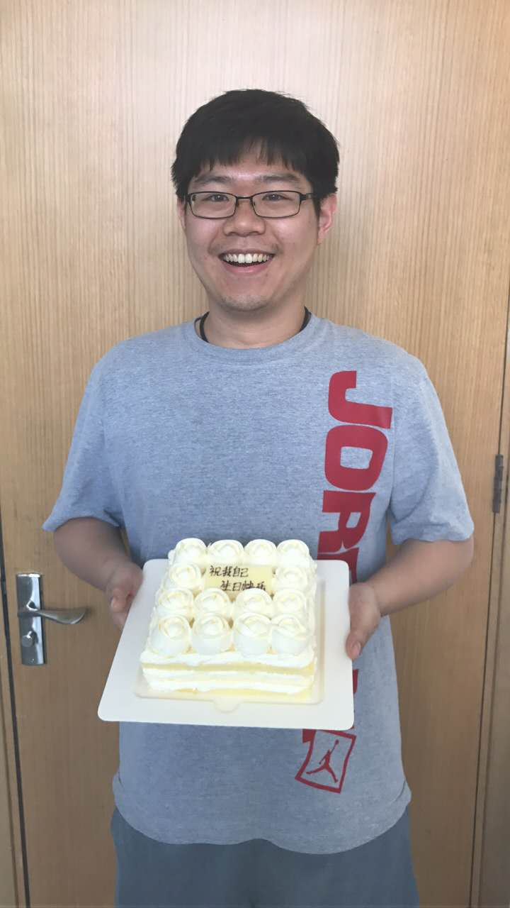

# Week21-22

六月来了，我26周岁了。

之前我为了更好的开发，提出要集中开发。可惜Z不给力，谈的屋子人家不给。于是我就搬到了另外一个实验室。端午当天，S看到我说怎么坐这里了。我说离得近问问题方便一些。这周又搬到了预定的屋子。仔细想想这个事情，正如S说的那样，人都不在有什么用？

六月来了，是我26周岁，细思极恐，都是快要到三十岁的人。生活平平淡淡，没有任何新意。想做的事情，依赖于别人不知道要怎么才能做成。不做该做的项目，自己想办法又觉得对不起上边带队的组长。有的时候，又觉得组长不够魄力，很多事情不敢冲上去，没有远见。生活中一下子需要面对好多决策，好多需要做决定的内容。或许这就是年龄增长需要面临的问题。

生日前一天，自己一个人在实验室写程序，内心憋屈。于是自己给自己买了一份生日蛋糕。写上对自己最真诚的祝福：祝我自己生日快乐！

