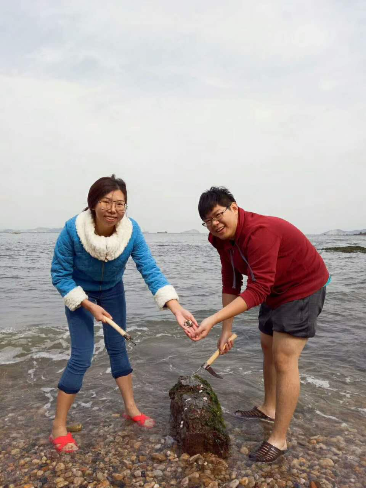
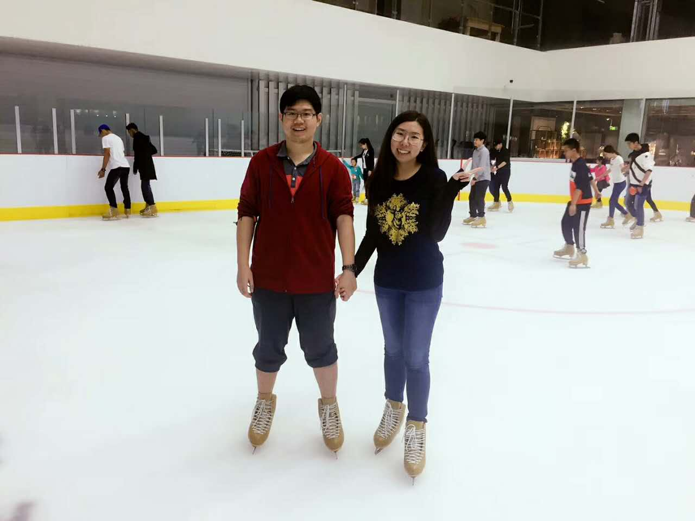
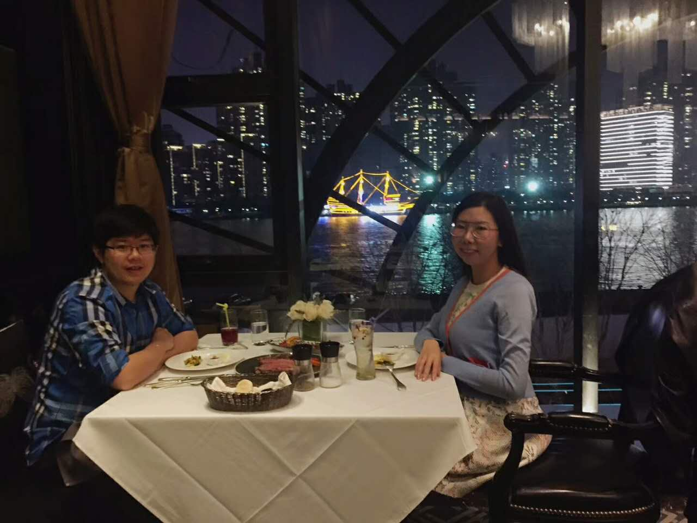

# 十月杂谈

现在看时间过的也是快。十月份有几件事情还算有意思：十一七天了、崴脚、上海过生日。

自打上大学离开家后就很少回家过十一。一方面是觉得回去这几天来回折腾不值当，另一方面来回花销也比较大。这次本来说是妹子来北京找我，后来也是机缘巧合和妹子一起回家过十一。这个假期还是很开心。没觉得做了很多事情，日子一天天很快就过去。把妹子介绍给家人认识，大家比较认可。这是非常棒的一件事情。十月三日和姐妹一同去海边玩，带了父亲做的赶海工具，专业！在海边的礁石挖生蚝吃，哈哈哈！后几天去吃了一个比较高档的自助餐，以及人生第一次滑冰。超六！

此后很不幸再一次被自行车撞到，落地的时候崴到脚。其实问题不大，自己逞强去开了一个会。造成了二次损伤。本来很容易养好的问题，变得很复杂。

十月份有一件大事，妹子的生日。这么多年，我还是第一次亲自陪妹子过生日。虽然腿脚不灵便，还是去了上海陪妹子过生日。吃了国内最高档的一次饭，一家意大利餐厅。饭菜本身很可口，重要的是妹子开心。做戏做全套，对自己的表现也是很满意。哈哈哈！今后，你的生日我一定不会错过。

生活上也就是这个样子，一周放假，回来刚收收心就扭伤，养了两周，去上海过生日。

工作上，这一个月关注在：value based framework，multi-entry，summary上。做的具体工作也是一些移植和学习。准确来说，并没有新的进展。而自己的研究也没有任何的工作，着实需要反省。现在自己的状态并不算好。一方面是自己有些怠慢，并没有抓紧去看相关的工作，也没有开足马力去做工程。另一方面，自己的松懈，可能是崴脚的原因，很多时候都在放纵。感觉自己是在刻意回避自己的研究方向。没有实际的动作，就没有实际的内容，那如何发论文呢？可以说连发论文的内容都没有。好在自己有几件事情做的还算好。利用十一的时间好好研究了Java8的lambda表达式和stream，跟上了潮流。另一方面，在养伤的几天里面，把被拒的文章转到latex投了出去。本来很早就给J看。自己不催促一直没有反应。直到今天问了才有结果，投出去。在这样的事情上，自己还是不够积极。论文的事情，自己不上心去催不会有结果。就像各种荣誉利益，自己不去争取，谁会想着你呢？同样的，对于自己的研究，自己不去付出努力，谁会把现成的成果给你呢？工程是发论文最好的契机，但是发论文的动力还是要自己提供。工作放在那里，你写了就是你的了。你需要提出写的想法，写的点子，拿出来可以和大家讨论。但是等着别人告诉你，我们写这个论文吧，怎么可能呢？现在看，大家都是在为自己利益而努力。到了现在的年级，也是时候去做出一些权衡。但是我觉得还是要坚持一个原则：如果做就做好，要不就不要做。

回想这个月

* Positive：专注有所改善。
* Negative：专注自己的事情。废话还是有点多。不够坚持，很松懈特别是崴脚后。没有为自己的研究方向做出努力。逞强。

