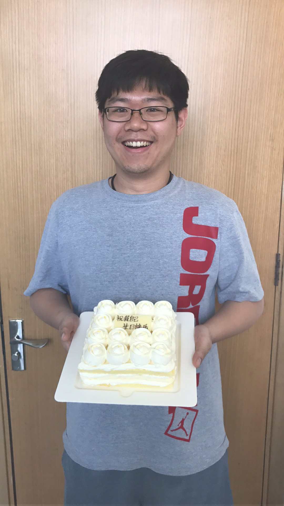
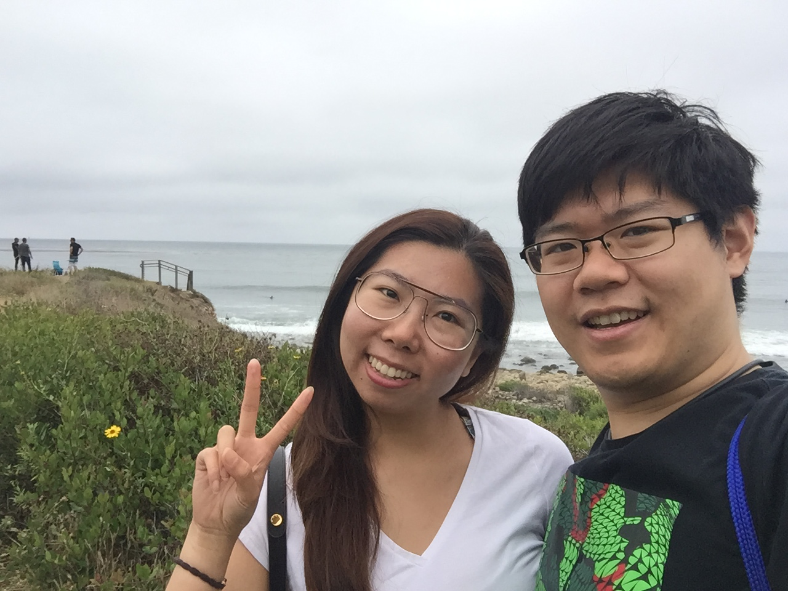
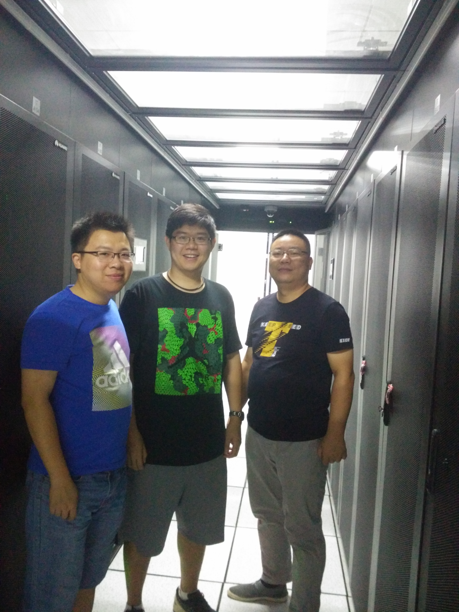
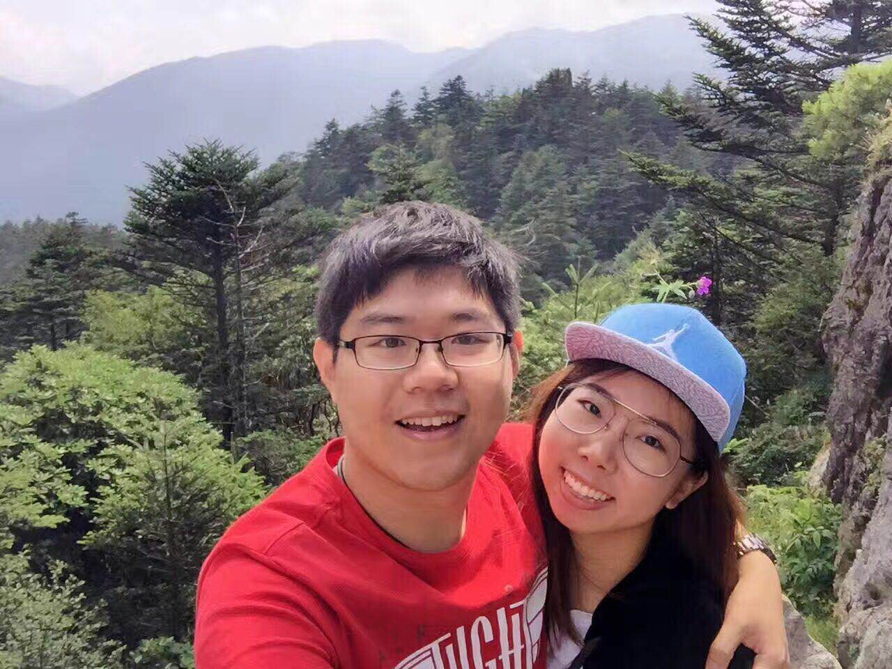
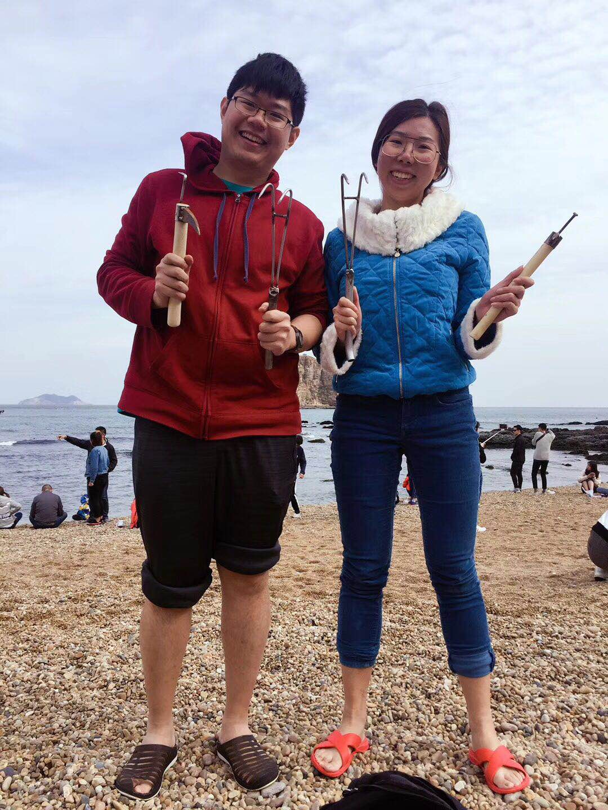

# Bye 2017, Hi 2018
今天是2017年12月27日，按计划我应该明天收拾收拾去上海陪小仙女跨年。然而我现在刚从北医三院回来，躺在床上，觉得很衰。好吧，这一年就要过去了，写点东西来记录这一年的经历。总结起来，2017年，好运气在前半年用完了；不如意的事情，在后半年集中爆发了而已。

### 2017

* 一月，忙着应付年终老爷爷的检查。累死累活，大腿累的不想干活了，W在期间还是搞了论文，投出去。这两件事，是后面的几件事情导火索。总算顺利回家过年了，还有奖金拿。

* 二月，回来后重构AccessSummary。大腿明确表态不想做纯工程，需要论文毕业。事态有些严峻。

* 三月，准备我的开题。期间发生了一件有意思的事情。老爷爷不让我们去开题，说我们没有A。我坚持去。结果我们这有点资历的老师都没去，三个人，倒是一二三。我侥幸通过。此时造成了非常恶劣的影响。我成了罪人，拉着自家兄弟给自己垫背。然而事实是什么样子，大家都心知肚明。后面直接就不允许没有A去开题。然而，十月份，不仅都去了，而且都过了。挂的是另一个老师的两个学生。

* 四月，大师兄想找一个人去做V3。我去了，一是我本身V2做的就不多，做什么对我来说都一样。另一是一个要毕业，一个要开题，V2可以留给他们写论文。后来，发生了尴尬的事。两位闹僵了，无非是干活和论文的事情。别人的事情，评论没有意义，我们不说。

* 五月，六月，在勤勤恳嗯的做V3。然而，我做了一件出格的事情。我觉得现在的工作状态大家都是混日子。工具做不好，论文也没有。于是找了G。结果这个事情搞得很大。大家都说改变现状，然而，到目前来看，并没有什么变化。

  

* 六月底到八月算是好日子，美帝接了小仙女、社会实践、回来休整。

  

  

  

* 九月，得知W已经中了三篇论文了，还不告诉我们，说想闷着称论文不够，不做工程发论文。这件事情直接就把我惹到了。也看不到V3的什么未来，一度很迷惑。不过后来也想明白了，在这样的队伍里面，想做成啥事也挺难的。还是随便毕业算了，好好找工作。

* 十月回家，第一次带小仙女见了家人，超开心。不过厄运来临，我的脚踝扭伤了。养了很久。

  

* 十一月，我渐渐意识到毕业的压力。让我比较窝心的是，J老师说挂大牛的名字，发论文能行。结果，几次都不行。其实就是内容都不相关。后来还让我这样搞，我就生气了。你自己搞论文，都是相关的，让我去投这些有的没的，都不会帮我改一改？

  

* 十二月，月初我经历了一次深刻的思考。到底现在的路线能不能毕业？最后得出结论，可以，投一篇toolpaper毕业。不要什么追求了，就这样吧。学术圈，我没能力混。也没人带我混。我带的两个小弟。有一个退学了。真的是退学了。压垮他的稻草就是让他三周完成一个任务，然而这个任务是我们一年的任务。他走之前和我聊了很久，对我说：你是怎么忍受这种SB环境这么久的？我当时想是啊，我是怎么忍受的？

很多细节，我都记录在平日里

### 开心的，不开心的

开心的事不多，一个算是成功开题，另一个算是小仙女回国重归于好。这个算是17年仅有的两件做成的事情吧。

不开心的：其他的所有事情好像都不好。身体不好；工作不够坚定、做做停停，到年底也没有什么收成；自己的研究方向也没有花时间去主动推进；自己带的小弟退学了。

### 重新评估

重新评估我自己这一年，我觉得是不及格的。其实我可以做的更好，不是吗？让我们来看看。

* 开题后，去做第三版，一开始是把这个当作事业在做，遇到困难后，我就松懈了，开始想混日子。混日子不爽，于是找了G。社会实践回来，本可以继续好好工作。然而也没有。谈过一次后，好转了，结果到现在也没有什么进展。其实能够感受到，内心是犹豫不决。觉得这个不行，又不肯彻底去找个行的事情，于是就这么耗着。倒不如铁下心来就做这个。不管做成什么样子，至少，tool还是可以有。
* 再说G，S说帮忙。其实自己也没有紧紧抓住这个机会，保持持续联系，突进。让这么好的承诺破灭了。最后，或许承诺都不记得了，祸都记得。
* 再说PSH那个期刊，前前后后的拖了很久。自然，没人帮我是一方面。自己也不够强硬。每次都侥幸抱着有人，事实是有的人，也不过是帮别人挂个名字罢了。你都是最底层，别人的交易你怎么会知道。最后，还不是要自己去投，自己改，自己去踩所有的坑。
* 再说说社会实践，有两个月的时间。这段时间，本是看点东西，学点东西的最好时间，我却再一次浪费掉了。感觉和在美帝的时候一样，没有约束的我还是享受派。这两个月或许就是这一年的缩影。懒懒散散，看着去实验室很多，其实效率很低。做的事情也都是体力活，并没有走心，就更不要说有目的计划的完成任务。
* 再说锻炼的事情。这就是一个死循环。每次想好好锻炼就遇到问题。遇到问题就不能锻炼。即使中间过程锻炼的好好的，也吃的有些多。最后，还是起点，多了几次伤病。今天去检查，脚底筋膜炎。体重大、低足弓。如果平时能够注意点，也不会发作。如果出现问题，第一次就去全方面的查好，也不会反反复复。

### 完成否

写到这里，其实自己觉得自己很失败，一年什么也没有做成。看看去年对自己的期望又完成了多少？

* 我的我 - 嘴巴大于身体。还是一样，说的话多。很多次告诫自己不要抱怨、不要和新生说黑历史，即使他们问也不要说。然而都说了。吃的也是多，还总想着减肥。平时有注意，但是太容易松懈。迈开腿做的也不好，锻炼贵在坚持。
* 我的我 - 效率低下。是的依旧低下。这种低下，体现在很多方面，注意力不集中，所以工作做的慢。论文看了不注意总结，反思，看了和没看一样。更多的时候还是机械性的工作。
* 我的我 - 轻浮。肚量小，又不服气，却不肯做出改变。背后议论别人，这事自己说了不止一次。
* 我的我 - 茫然。自然，茫然。从做工程到自己的研究，没有一样是有明确计划的。这种计划不是说，我要投论文这种不着边际的目标。而是要具体的投什么内容，什么时间，如何开展。

17年我希望

- 我的身体比嘴巴勤快：健康饮食，健康作息，多锻炼；能够少说点废话，多做点事情。失败了！
- 我的心智成熟一些：少一些抱怨，多一些思考；少一些议论，多一些理解；少一些虚伪，多一些真诚；少一些骄傲，多一些谦虚。失败了！
- 我的效率提高一点点：尽可能避免机械性的总结，做事，多动脑；尽可能的抓紧时间做该做的事情，时间不多了。失败了！
- 我的茫然少一些：做事情，多思考，确定一个小的目标，一点点来。失败了！
- 三月前明确开题内容。完成
- 体重减到82Kg。失败
- 肌肉力量增长30%（卧推到20KG／边）失败
- 明确研究方向（做出三年详细规划-需要做什么，需要掌握什么，如何实施计划）失败
- 投稿论文两篇（PSH期刊十二月前，程序分析-接口ASE 5,TASE 5.5, APSEC 7, ICSE 8,ICST 9.5, ）失败，完成一半
- 参加几次艺术活动 没有
- 每六个月阅读一本经典计算机书籍或学习一门技术或一门语言（Clojure，待定啦）看了形式语义、程序结构、回顾了数据结构，都不够深入
- 每两个月看一本非专业书籍（人类简史，从0到1，Team Geak，Why program Fail，待定）人类简史、独居的一年、一句顶一万句、月族、七习惯
- 每个月写一个长博客 不好，多是抱怨
- 每两周写一次总结 不好，多是抱怨，最后直接不写了
- 每周和家里通话一次 几乎没有
- 每周做好下一周计划 很好
- 每周锻炼5天 失败
- 每天留出晚上的时间给自己充电（22-24）没有

失败的一年，不是吗？

### 2018，我想

* 真的要好好控制体重了，希望这一年能够减重到80kg。目前我还在和足底筋膜炎抗争。等这个完全好了，能够正常走路后，到过年前，我想每日做好康复训练，包括脚踝的训练。年后回来，找一个私人教练，好好的锻炼。
* 控制饮食。晚饭就不要吃主食了，最好不吃。午饭减少米饭的摄入量。不喝饮料，尽量不吃油炸食品。减少和别人下馆子，如果不得不，少吃一定要少吃。不喝酒！
* 思想坚定。多思考，想好了就不要动摇，不要去关注别人的行为。V3还是要做，不要患得患失，坚持做下去，到了六月份肯定能够拿出一个版本来写文章。自己的接口行为也要自己上心安排时间每天去推进。
* 内敛。少说话、少发表意见、少和别人吐槽、更不要集体议论、处事圆滑小心。
* 投稿论文：PSH期刊持续推进、ASE tool 和 ASE new idea投V3、准备接口的论文投18年12月后面的会议（compsac、fse）
* 每两个月：听一场艺术活动、看一本书，同时找好下一个
* 每月：记录做了什么事情、技术总结至少有一个、做好月工作计划
* 每周：和家里视屏、做好一周工作计划
* 每日：锻炼康复训练、泡脚、完成当日要完成的任务、看薄荷阅读、做和毕业有关的工作、每天睡觉前总结

时间不多了，毕业压力很大。我觉得自己前几年过的不够紧张，没有竭尽全力。现在我们看看，自己能够做的多好😄！

