# Balanced Search Trees

The operations on a binary search tree are O(log n) if the tree is balanced. Unfortunately, the add and remove operations do not ensure that a binary search tree remains balanced.

### AVL Tree

This idea of rearranging nodes to balance a tree was first developed in 1962 by two mathema- ticians, Adel’son-Vel’skii and Landis. Named after them, the **AVL tree is a binary search tree that rearranges its nodes whenever it becomes unbalanced.** The balance of a binary search tree is upset only when you add or remove a node. Thus, during these operations, the AVL tree rearranges nodes as necessary to maintain its balance.

In discussing balance, we sometimes will mention a **balanced node**. A node is balanced if it is the root of a balanced tree, that is, if its two subtrees differ in height by no more than 1. If the node rotates to right child, it is called **right rotation**. Else is **left rotation**.

#### Rotations

N is the first node that is unbalanced along the path between the inserted leaf and N.

**Right rotations**

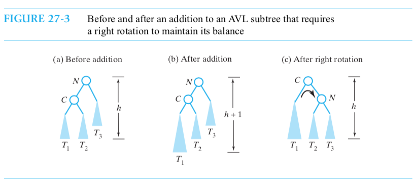

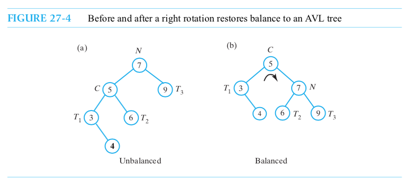

```java
Algorithm rotateRight(nodeN)
// Corrects an imbalance at a given node nodeN due to an addition 
// in the left subtree of nodeN’s left child.
nodeC = left child of nodeN
Set nodeN’s left child to nodec’s right child 
Set nodeC’s right child to nodeN
return nodeC
```

**Left rotation**

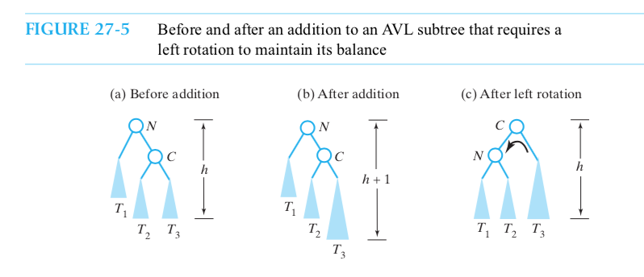

```java
Algorithm rotateLeft(nodeN)
// Corrects an imbalance at a given node nodeN due to an addition 
// in the right subtree of nodeN’s right child.
nodeC = right child of nodeN
Set nodeN’s right child to nodeC’s left child 
Set nodeC’s left child to nodeN
return nodeC
```

**Right-left rotation**

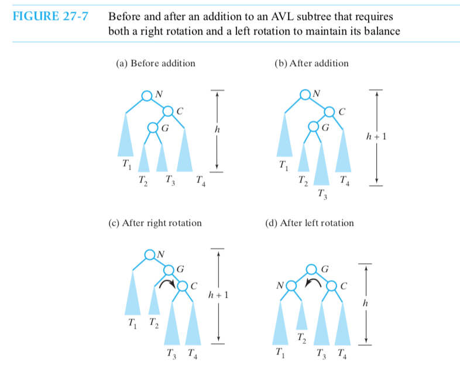

```java
Algorithm rotateRightLeft(nodeN)
// Corrects an imbalance at a given node nodeN due to an addition 
// in the left subtree of nodeN’s right child.
nodeC = right child of nodeN
Set nodeN’s right child to the node returned by rotateRight(nodeC) 
return rotateLeft(nodeN)
```

**Left-right rotation**

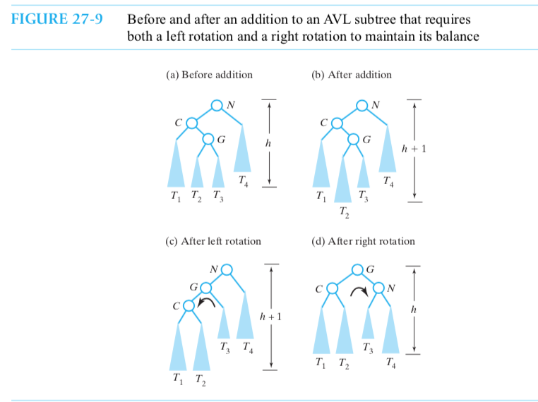

```java
Algorithm rotateLeftRight(nodeN)
// Corrects an imbalance at a given node nodeN due to an addition 
// in the right subtree of nodeN’s left child.
nodeC = left child of nodeN
Set nodeN’s left child to the node returned by rotateLeft(nodeC) return rotateRight(nodeN)
```

**Summary**

* The addition occurred in the left subtree of N’s left child (right rotation)
* The addition occurred in the right subtree of N’s left child (left-right rotation)
* The addition occurred in the left subtree of N’s right child (right-left rotation)
* The addition occurred in the right subtree of N’s right child (left rotation)

**Implementation based on search tree**

1. add into root, rebalance root, set root
2. when addEntry, add -> rebalance-> set back

```java
private BinaryNodeInterface<T> rebalance(BinaryNodeInterface<T> nodeN) {
int heightDifference = getHeightDifference(nodeN);
if (heightDifference > 1)
{ // left subtree is taller by more than 1,
  // so addition was in left subtree
if (getHeightDifference(nodeN.getLeftChild()) > 0) 
  // addition was in left subtree of left child 
  nodeN = rotateRight(nodeN);
else
  // addition was in right subtree of left child
  nodeN = rotateLeftRight(nodeN);
}
else if (heightDifference < -1)
{ // right subtree is taller by more than 1,
  // so addition was in right subtree
if (getHeightDifference(nodeN.getRightChild()) < 0) 
  // addition was in right subtree of right child 
  nodeN = rotateLeft(nodeN);
else
  // addition was in left subtree of right child
  nodeN = rotateRightLeft(nodeN);
} // end if
                         // else nodeN is balanced
return nodeN;
} // end rebalance
```

```java
public T add(T newEntry) {
T result = null;
if (isEmpty())
setRootNode(new BinaryNode<T>(newEntry));
else{
BinaryNodeInterface<T> rootNode = getRootNode();
result = addEntry(rootNode, newEntry);
setRootNode(rebalance(rootNode));
} // end if 
  return result;
} // end add
```

```java
private T addEntry(BinaryNodeInterface<T> rootNode, T newEntry) {
assert rootNode != null;
T result = null;
int comparison = newEntry.compareTo(rootNode.getData());
if (comparison == 0) {
  result = rootNode.getData();
  rootNode.setData(newEntry);
  }
else if (comparison < 0) {
if (rootNode.hasLeftChild()) {
BinaryNodeInterface<T> leftChild = rootNode.getLeftChild();
result = addEntry(leftChild, newEntry);
rootNode.setLeftChild(rebalance(leftChild));
}
else
rootNode.setLeftChild(new BinaryNode<T>(newEntry));
}
else
{
assert comparison > 0;
if (rootNode.hasRightChild()) {
BinaryNodeInterface<T> rightChild = rootNode.getRightChild();
result = addEntry(rightChild, newEntry);                     rootNode.setRightChild(rebalance(rightChild));
}
else
rootNode.setRightChild(new BinaryNode<T>(newEntry));
} // end if return result;
} // end addEntry

```

### 2-3 Tree

A 2-3 tree is a general search tree whose interior nodes must have either two or three children. 

A 2-node contains one data item s and has two children, like the nodes in a binary search tree. This data s is greater than any data in the node’s left subtree and less than any data in the right subtree. That is, the data in the node’s left subtree is less than s, and any data in the right subtree is greater than s.

A 3-node contains two data items, s and l, and has three children. Data that is less than the smaller data item s occurs in the node’s left subtree. Data that is greater than the larger data item l occurs in the node’s right subtree. Data that is between s and l occurs in the node’s middle subtree.

**Because it can contain 3-nodes, a 2-3 tree tends to be shorter than a binary search tree. To make the 2-3 tree balanced, we require that all leaves occur on the same level. Thus, a 2-3 tree is com- pletely balanced.**

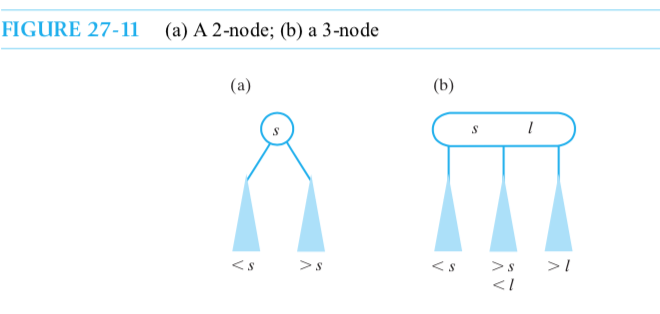

**Search**

```java
Algorithm search23Tree(23Tree, desiredObject) 
// Searches a 2-3 tree for a given object.
// Returns true if the object is found.
  if (23Tree is empty) return false
else if (desiredObject is in the root of 23Tree) return true
else if (the root of 23Tree contains two entries) {
	if (desiredObject<smaller object in the root)
	return search23Tree(left subtree of 23Tree, desiredObject)
  	else if (desiredObject >larger object in theroot)
	return search23Tree(right subtree of 23Tree, desiredObject)
	else
	return search23Tree(middle subtree of 23Tree, desiredObject)
}
else if (desiredObject < object in the root)
return search23Tree(left subtree of 23Tree, desiredObject) 
else
return search23Tree(right subtree of 23Tree, desiredObject)
```

**Add and Split**

First add, if has three data, the split and go back.

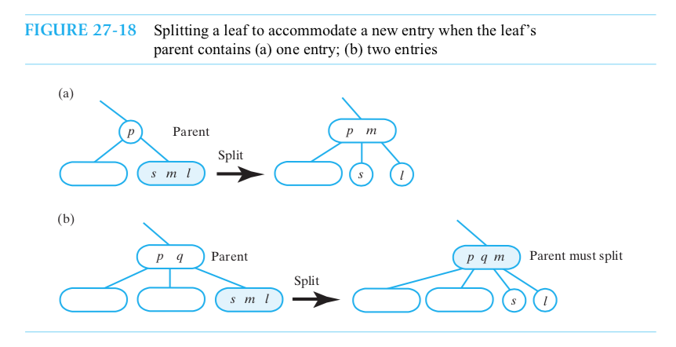

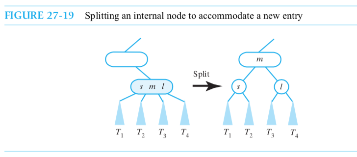

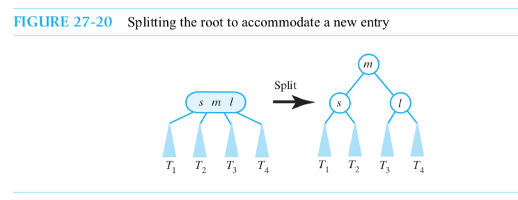


### Red-Black Trees

Maintaining the balance of a 2-4 tree is easier than maintaining either an AVL tree or a 2-3 tree. While a 2-4 tree is a general tree, **a red-black tree is a binary tree that is equivalent to a 2-4 tree. Adding an entry to a red-black tree is like adding an entry to a 2-4 tree, in that only one pass from root to leaf is necessary.** But a red-black tree is a binary tree, so it uses simpler operations to maintain its balance than does a 2-4 tree. Additionally, the implementation of a red-black tree uses only 2-nodes, whereas a 2-4 tree requires 2-nodes, 3-nodes, and 4-nodes. This added require- ment of a 2-4 tree makes it less desirable than a red-black tree.

When designing a node for the 2-4 tree, you need to decide how to represent the entries that are in the node. Since you must order these entries, you could use an ADT such as the sorted list for the entries. You might also use a binary search tree. 


### 2-4 Trees

A 2-4 tree, sometimes called a 2-3-4 tree, is a general search tree whose interior nodes must have either two, three, or four children and whose leaves occur on the same level. In addition to 2-nodes and 3-nodes, as we described in the previous section, this tree also contains 4-nodes. A 4-node con- tains three data items s, m, and l and has four children.

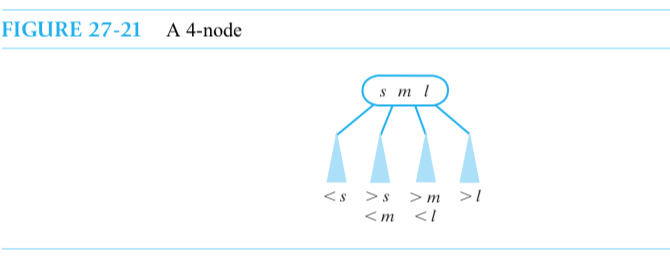

**Add**

Recall how we add a new entry to a 2-3 tree. We make comparisons along a path that begins at the root and ends at a leaf. At this point, if the leaf is a 3-node, it already contains two data entries, and so we must split it. Since an entry would now move up a level, this split could require splits in nodes above the leaf. **Thus, adding to a 2-3 tree can require us to retrace the path from the leaf back to the root.**

In a 2-4 tree, we avoid this retrace by **splitting each 4-node as soon as we first consider it dur- ing the search from root to leaf.** After a split, the next node along the comparison path is the result of the split, and so is not a 4-node. If this node has a 4-node child that we consider next, it has room for the entry that moves up from this child. No other splits occur, as would happen in a 2-3 tree. 

That is from the root, if we meet already three data, we split first(move the middle to parent) and then add to its child. Finally, it will reach leaf. IF leaf has three child, move the middle to parent. Notice, at beginning we have already make sure that there is a enough place to hold this midlle into the parrent.

**Each time we convert a 3-node or a 4-node to a 2-node, we increase the height of the tree.** We use color to highlight the new nodes that cause this increase in height. We use **black for all the nodes in the original 2-4 tree.** Since we do not change the 2-nodes, they remain black in the new tree.

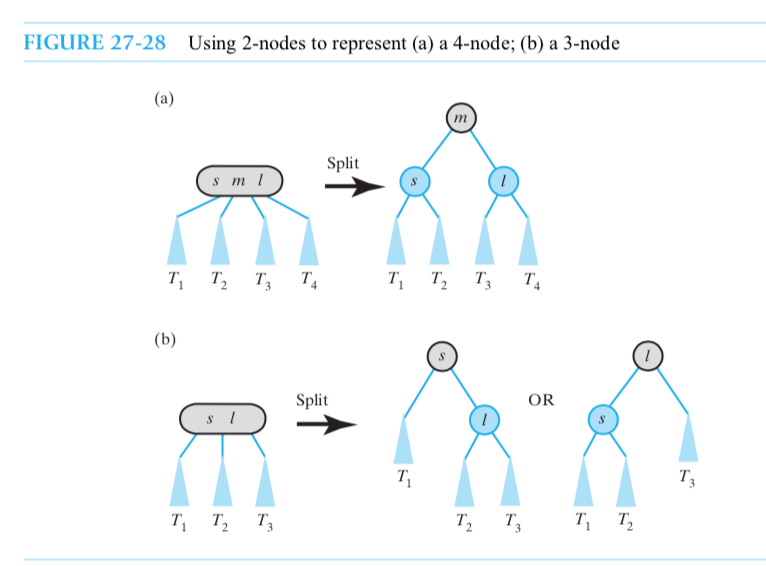

**Properties of a red-black tree**

1. The root is black
2. Every red node has a black parent.
3. Any children of a red node are black; that is, a red node cannot hava red children.
4. Every path from the root to a leaf contains the same number of black nodes.

**Adding a leaf**

An addition to a binary search tree always occurs at a leaf, so the same is true for a red-black tree. If we use black for a new leaf, we will increase the number of black nodes on the paths to that leaf. This increase violates the fourth property of a red-black tree. **Thus, any new node must be red.** However, do not assume that all the leaves in a red-black tree are red.

If the root is empty, add into a black node as root.

1. add into one-node

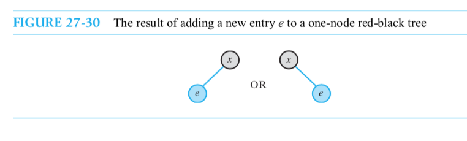

2. add into two-node

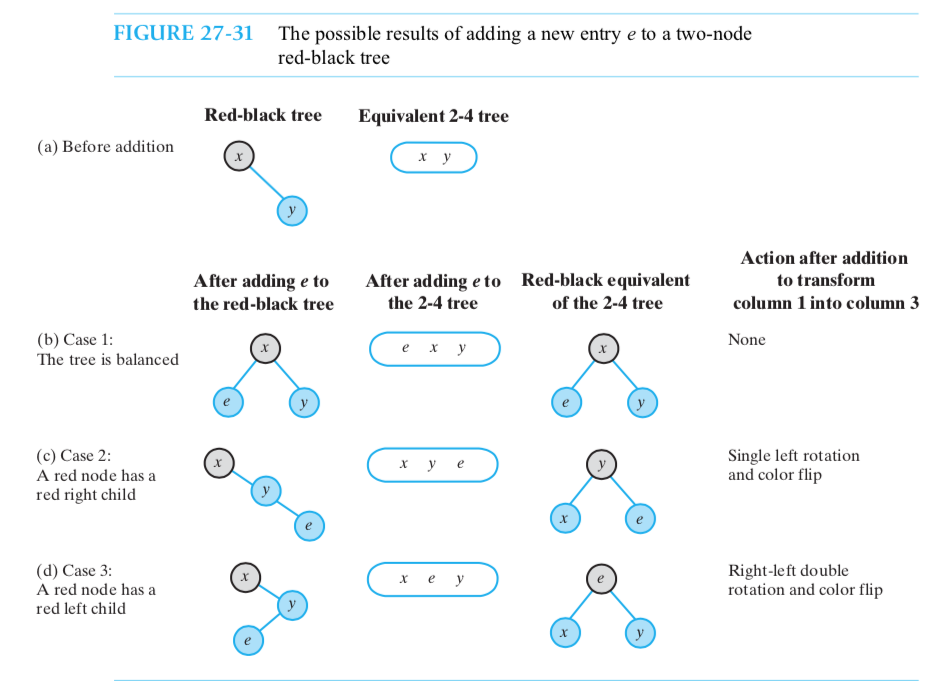

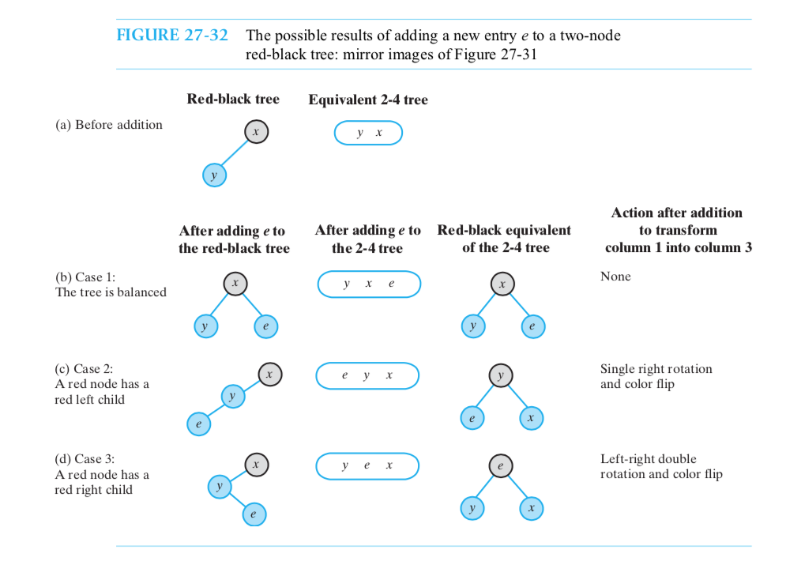

**Splitting**

During an addition to a 2-4 tree, we split any 4-nodes that we encounter as we move along the path from the root to the eventual insertion point. That is add from root to leaf, when we meet a node should split, we split first.

**splitting a 4-node whose parent is black** 

that is a black node and two red children. So, we have to split it.

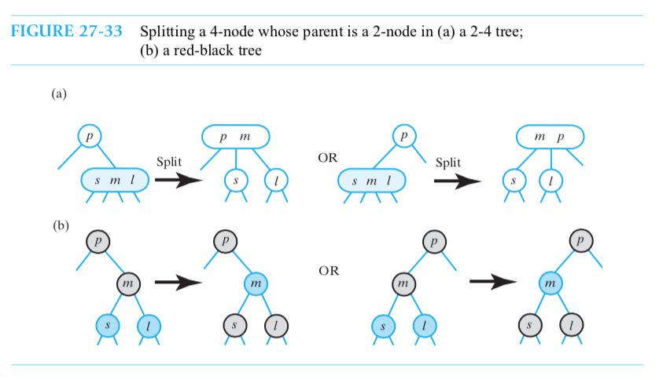

**splitting a 4-node whose parent is red**

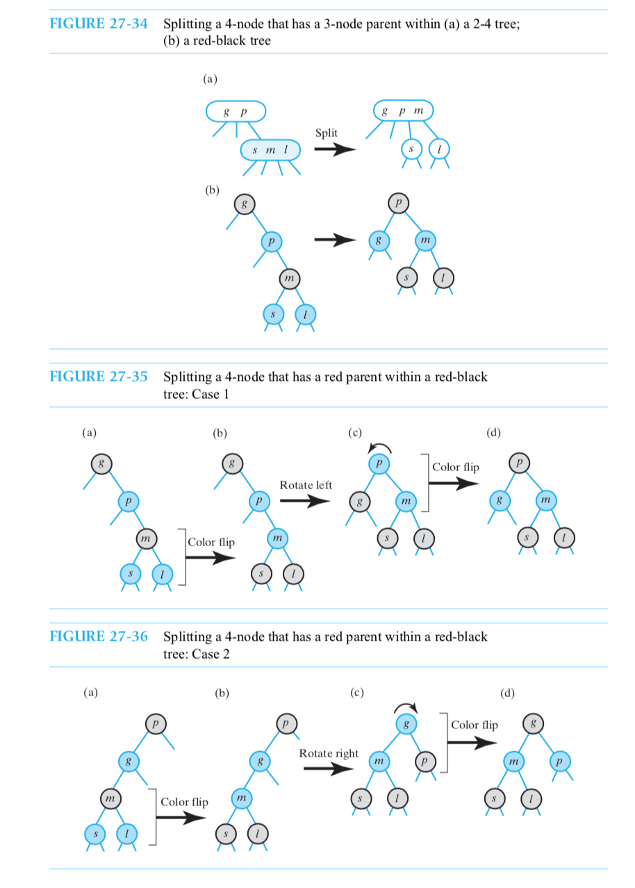

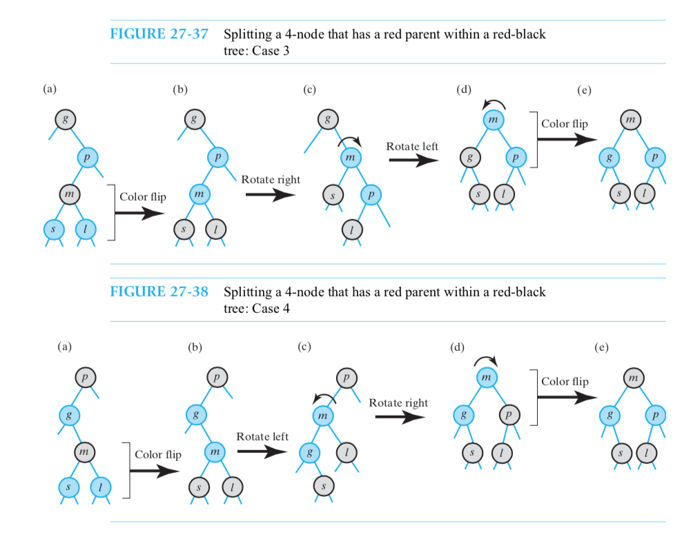

### B-Trees

A multiway search tree of order m—or sometimes an m-way search tree—is a general tree whose nodes have up to m children each. A node that has k - 1 data items and k children is called a k-node. An order m multiway search tree can contain k-nodes for values of k ranging from 2 to m.

A B-tree of order m is a balanced multiway search tree of order m that has the following additional properties to maintain its balance:
* The root has either no children or between 2 and m children.

* Other interior nodes (nonleaves) have between m ⁄ 2 and m children each. 

* All leaves are on the same level.

2-3 and 2-4 trees satisfy these constraints, and so are examples of B-trees.

Accessing data in external memory is much slower than accessing data in main memory. When reading external data, the major cost is locating it on the storage device. Data on a disk, for exam- ple, is organized sequentially into blocks, whose size depends on the physical characteristics of the disk. When you read data from a disk, an entire block is read. Locating the block takes much more time than reading the data. If each block contains the data for at least one node, you can reduce the access time by placing numerous data items in each node. Although many comparisons per node could be necessary, their cost is much less than the cost of accessing external data.

Since increasing the number of data items per node decreases the tree’s height, you decrease the number of nodes that you must search and hence the number of disk accesses. A high-order B-tree fits these requirements. You would choose the order m so that m - 1 data items fit into a block on the disk.