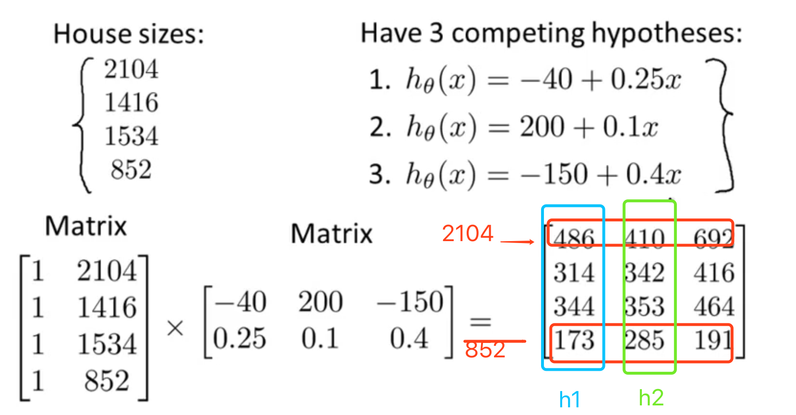

# Linear Algebra

> The course is from https://www.coursera.org/learn/machine-learning/home/welcome


Matrices are 2-dimensional arrays:
$$
\begin{bmatrix} a & b & c \newline d & e & f \newline g & h & i \newline j & k & l\end{bmatrix}
$$
The above matrix has four rows and three columns, so it is a 4 x 3 matrix. Also written as $\mathbb{R^{4\times3}}$.

A vector is a matrix with one column and many rows:
$$
\begin{bmatrix} w \newline x \newline y \newline z \end{bmatrix}
$$

So vectors are a subset of matrices. The above vector is a 4 x 1 matrix.

### **Notation and terms**:

- $A_{ij}$ refers to the element in the ith row and jth column of matrix A.
- A vector with 'n' rows is referred to as an 'n'-dimensional vector.
- $v_i$ refers to the element in the ith row of the vector.
- In general, all our vectors and matrices will be 1-indexed. Note that for some programming languages, the arrays are 0-indexed.
- Matrices are usually denoted by uppercase names while vectors are lowercase.
- "Scalar" means that an object is a single value, not a vector or matrix.
- $\mathbb{R}$ refers to the set of scalar real numbers.
- $\mathbb{R^n}$ refers to the set of n-dimensional vectors of real numbers.

```matlab
% The ; denotes we are going back to a new row.
A = [1, 2, 3; 4, 5, 6; 7, 8, 9; 10, 11, 12]
% Initialize a vector 
v = [1;2;3] 
% Get the dimension of the matrix A where m = rows and n = columns
[m,n] = size(A)
% You could also store it this way
dim_A = size(A)
% Get the dimension of the vector v 
dim_v = size(v)
% Now let's index into the 2nd row 3rd column of matrix A
A_23 = A(2,3)

Result:
A =
     1     2     3
     4     5     6
     7     8     9
    10    11    12
v =
     1
     2
     3
m =
     4
n =
     3
dim_A =
     4     3
dim_v =
     3     1
A_23 =
     6
```


### Addition and Scalar Multiplication

Addition and subtraction are **element-wise**, so you simply add or subtract each corresponding element:
$$
\begin{bmatrix} a & b \newline c & d \newline \end{bmatrix} +\begin{bmatrix} w & x \newline y & z \newline \end{bmatrix} =\begin{bmatrix} a+w & b+x \newline c+y & d+z \newline \end{bmatrix}
$$

$$
\begin{bmatrix} a & b \newline c & d \newline \end{bmatrix} - \begin{bmatrix} w & x \newline y & z \newline \end{bmatrix} =\begin{bmatrix} a-w & b-x \newline c-y & d-z \newline \end{bmatrix}
$$

$$
\begin{bmatrix} a & b \newline c & d \newline \end{bmatrix} * x =\begin{bmatrix} a*x & b*x \newline c*x & d*x \newline \end{bmatrix}
$$

$$
\begin{bmatrix} a & b \newline c & d \newline \end{bmatrix} / x =\begin{bmatrix} a /x & b/x \newline c /x & d /x \newline \end{bmatrix}
$$

```matlab
% Initialize matrix A and B 
A = [1, 2, 4; 5, 3, 2]
B = [1, 3, 4; 1, 1, 1]
% Initialize constant s 
s = 2
% See how element-wise addition works
add_AB = A + B 
% See how element-wise subtraction works
sub_AB = A - B
% See how scalar multiplication works
mult_As = A * s
% Divide A by s
div_As = A / s
% What happens if we have a Matrix + scalar?
add_As = A + s
A =
     1     2     4
     5     3     2
B =
     1     3     4
     1     1     1
s =
     2
add_AB =
     2     5     8
     6     4     3
sub_AB =
     0    -1     0
     4     2     1
mult_As =
     2     4     8
    10     6     4
div_As =
    0.5000    1.0000    2.0000
    2.5000    1.5000    1.0000
add_As =
     3     4     6
     7     5     4
```

### Matrix-Vector Multiplication

$$
\begin{bmatrix} a & b \newline c & d \newline e & f \end{bmatrix} *\begin{bmatrix} x \newline y \newline \end{bmatrix} =\begin{bmatrix} a*x + b*y \newline c*x + d*y \newline e*x + f*y\end{bmatrix}
$$

The result is a **vector**. The number of **columns** of the matrix must equal the number of **rows** of the vector.

An **m x n matrix** multiplied by an **n x 1 vector** results in an **m x 1 vector**.

```matlab
% Initialize matrix A 
A = [1, 2, 3; 4, 5, 6;7, 8, 9] 
% Initialize vector v 
v = [1; 1; 1] 
% Multiply A * v
Av = A * v

Av =
     6
    15
    24

```

### Matrix-Matrix Multiplication

$$
\begin{bmatrix} a & b \newline c & d \newline e & f \end{bmatrix} *\begin{bmatrix} w & x \newline y & z \newline \end{bmatrix} =\begin{bmatrix} a*w + b*y & a*x + b*z \newline c*w + d*y & c*x + d*z \newline e*w + f*y & e*x + f*z\end{bmatrix}
$$

An **m x n matrix** multiplied by an **n x o matrix** results in an **m x o** matrix. In the above example, a 3 x 2 matrix times a 2 x 2 matrix resulted in a 3 x 2 matrix.

To multiply two matrices, the number of **columns** of the first matrix must equal the number of **rows** of the second matrix.

```matlab
A = [1, 2; 3, 4;5, 6]
% Initialize a 2 by 1 matrix 
B = [1; 2] 
% We expect a resulting matrix of (3 by 2)*(2 by 1) = (3 by 1) 
mult_AB = A*B

mult_AB =
     5
    11
    17
```

For example




### Matrix Multiplication Properties

- Matrices are not commutative: A∗B≠B∗A
- Matrices are associative: (A∗B)∗C=A∗(B∗C)

The **identity matrix**, when multiplied by any matrix of the same dimensions, results in the original matrix. It's just like multiplying numbers by 1. The identity matrix simply has 1's on the diagonal (upper left to lower right diagonal) and 0's elsewhere.
$$
\begin{bmatrix} 1 & 0 & 0 \newline 0 & 1 & 0 \newline 0 & 0 & 1 \newline \end{bmatrix}
$$
When multiplying the identity matrix after some matrix (A∗I), the square identity matrix's dimension should match the other matrix's **columns**. When multiplying the identity matrix before some other matrix (I∗A), the square identity matrix's dimension should match the other matrix's **rows**.

```matlib
A =
     1     2
     4     5
B =
     1     1
     0     2
% Initialize a 2 by 2 identity matrix
I = eye(2)
I =
     1     0
     0     1
IA =
     1     2
     4     5
AI =
     1     2
     4     5
AB =
     1     5
     4    14
BA =
     5     7
     8    10
```

### Inverse and Transpose

The **inverse** of a matrix A is denoted $A^{−1}$. Multiplying by the inverse results in the identity matrix.

A non square matrix does not have an inverse matrix. We can compute inverses of matrices in octave with the $pinv(A)$ function and in Matlab with the $inv(A)$ function. Matrices that don't have an inverse are *singular* or *degenerate*.

The **transposition** of a matrix is like rotating the matrix 90**°** in clockwise direction and then reversing it. We can compute transposition of matrices in matlab with the transpose(A) function or A'. $A_{ij} = A^T_{ji}$

```matlib
A =
     1     2     0
     0     5     6
     7     0     9
% Transpose A 
A_trans = A' 
A_trans =
     1     0     7
     2     5     0
     0     6     9

% Take the inverse of A 
A_inv = inv(A)
A_inv =
    0.3488   -0.1395    0.0930
    0.3256    0.0698   -0.0465
   -0.2713    0.1085    0.0388

% What is A^(-1)*A? 
A_invA = inv(A)*A
A_invA =
    1.0000   -0.0000    0.0000
    0.0000    1.0000   -0.0000
   -0.0000    0.0000    1.0000
```

