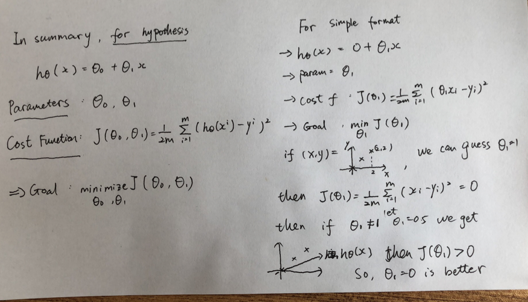
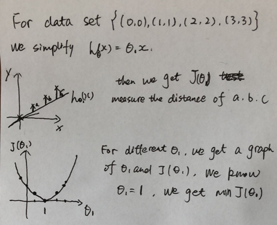
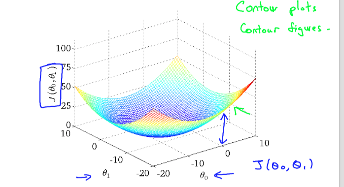
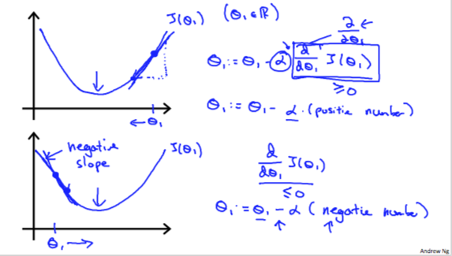
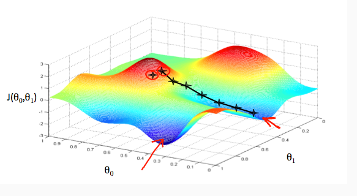
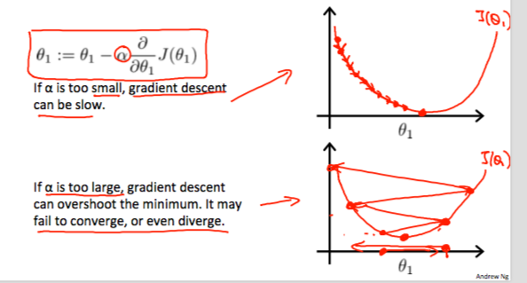
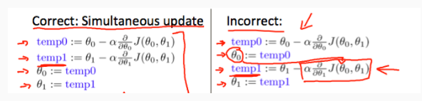

# Week1

> The course is from https://www.coursera.org/learn/machine-learning/home/welcome

### Why machine learning is so prevalent today?

1. Grew out of work in AI
2. New capability for computers 
3. There are lots of data can be used

在我看来，数据是重要的。如果没有这些数据做训练，再好的算法也没有用武之地。其次就是计算的能力。


---

### What is Machine Learning?

•ArthurSamuel (1959). Machine Learning: Field of study that gives computers theability to learn without being explicitly programmed. 

•TomMitchell (1998) Well-posed Learning Problem: A computer program is said to *learn* from experience E with respect to some task T and some performance measure P, if its performance on T, as measured by P, improves with experience E. 

Example: playing checkers.

E = the experience of playing many games of checkers

T = the task of playing checkers.

P = the probability that the program will win the next game.

In general, any machine learning problem can be assigned to one of two broad classifications:

Supervised learning and Unsupervised learning.

So what we're going to do in this class is actually spend a lot of time talking about how, if you actually tried to develop a machine learning system, how to **make those best practices type decisions about the way in which you build your system** so that when you're applying learning algorithm. 所以说真正的核心是理解里面的原理，然后去改装应用在自己的问题上。


---

### Supervised Learning

**right answers given** 核心就是已经知道问题的答案

In supervised learning, we are given a data set and **already know what our correct output should look like**, having the idea that there is a relationship between the input and the output.

**Supervised learning problems are categorized into "regression" and "classification" problems.** In a **regression problem, we are trying to predict results** within a continuous output, meaning that we are trying to map input variables to some continuous function. In a **classification problem, we are instead trying to predict results in a discrete output**. In other words, we are trying to map input variables into discrete categories.

**Example 1:**

Given data about the size of houses on the real estate market, try to predict their price. Price as a function of size is a continuous output, so this is a regression problem.

We could turn this example into a classification problem by instead making our output about whether the house "sells for more or less than the asking price." Here we are classifying the houses based on price into two discrete categories.

**Example 2**:

(a) Regression - Given a picture of a person, we have to predict their age on the basis of the given picture

(b) Classification - Given a patient with a tumor, we have to predict whether the tumor is malignant or benign.


---

### Unsupervised Learning

Unsupervised learning allows us to approach problems with little or no idea what our results should look like. **We can derive structure from data where we don't necessarily know the effect of the variables.**

We can derive this structure by clustering the data based on relationships among the variables in the data.

**With unsupervised learning there is no feedback based on the prediction results.**

**Example:**

Clustering: Take a collection of 1,000,000 different genes, and find a way to automatically group these genes into groups that are somehow similar or related by different variables, such as lifespan, location, roles, and so on.

Non-clustering: The "Cocktail Party Algorithm", allows you to find structure in a chaotic environment. (i.e. identifying individual voices and music from a mesh of sounds at a [cocktail party](https://en.wikipedia.org/wiki/Cocktail_party_effect)).


---

### Model Representation

**Notation**

```
m = Number of training examples
x's = "input" variable / features
y's = "output" variable / "target" variable
(x, y) = one training example
(x_i, y_i) = i-th training example
h = hypothesis

```

$h(x) = \theta_0 + \theta_1x$, is called **Linear regression with one variable, also called Univariate linear regression.**

To describe the supervised learning problem slightly more formally, our goal is, given a training set, to learn a function h : X → Y so that h(x) is a “good” predictor for the corresponding value of y. For historical reasons, this function h is called a **hypothesis**. Seen pictorially, the process is therefore like this:


When the target variable that we’re trying to predict is continuous, such as in our housing example, we call the learning problem a regression problem. When y can take on only a small number of discrete values (such as if, given the living area, we wanted to predict if a dwelling is a house or an apartment, say), we call it a classification problem.


---

### Cost Function

Cost Function is used to evaluate how our hypothesis works. For example, that will let us figure out how to fit the best possible straight line for linear regression.


We can measure the accuracy of our hypothesis function by using a **cost function**. This takes an average difference (actually a fancier version of an average) of all the results of the hypothesis with inputs from x's and the actual output y's.

$$
J(\theta_0, \theta_1) = \dfrac {1}{2m} \displaystyle \sum _{i=1}^m \left ( \hat{y}_{i}- y_{i} \right)^2 = \dfrac {1}{2m} \displaystyle \sum _{i=1}^m \left (h_\theta (x_{i}) - y_{i} \right)^2
$$

This function is otherwise called the "Squared error function", or "Mean squared error".  

We use 1/2 as a convenience for the computation of the gradient descent, as the derivative term of the square function will cancel out the 1/2.

#### So, what the cost function is doing ? Why it works?



If we try to think of it in visual terms, our training data set is scattered on the x-y plane. We are trying to make a straight line (defined by hθ(x)) which passes through these scattered data points.

Our objective is to get the best possible line. The best possible line will be such so that the average squared vertical distances of the scattered points from the line will be the least. Ideally, the line should pass through all the points of our training data set. In such a case, the value of J(θ0,θ1) will be 0.



Here, we can learn that how to get the best parameters? We can guess a number a, then we have J(a). Then, we guess b, we have J(b). We can compare J(a) and J(b) to choose a or b. Then we also can use the relation between J(a) J(b) and a b to guess the third parameter c. That is if b>a and J(b)>J(a), we can guess a c<a, to check whether J(c) < J(a).

For the original problem, 




A contour plot is a graph that contains many contour lines. A contour line of a two variable function has a constant value at all points of the same line. An example of such a graph is the one to the right below.

### Parameter Learning

For now, we have know what the cost function is doing. Then, we can use the cost function as a standard and to learn our parameters. 

#### Gradient descent

**Problem description**: Have some function $J(\theta_0, \theta_1)$, we want the $\min\limits_{\theta_0, \theta_1} J(\theta_0, \theta_1)$.

**Outline**: Starte with some $\theta_0, \theta_1$, keep changing them to reduce J until we hopefully end up at a minimum

**Heuristic**: Select the direction go down most quickly -> this is the local best result. We make steps down the cost function in the direction with the steepest descent. The size of each step is determined by the parameter α, which is called the **learning rate**. If it is too large, gradient descent can overshoot the minimum, that it may fail to converge or even diverge.

**Algorithm**

repeat until convergence {
$$
\theta_j := \theta_j - \alpha \frac{\partial}{\partial \theta_j} J(\theta_0, \theta_1)
$$
} for j = 0 and j = 1

当倒数时零时，也就是到了一个底部。

也就是说，我们的目标是取最小的J。如果当前的系数有了，我们看这个系数对J的影响，也就是导数。如果导数是正的，那么就是说系数和结果是正相关，那么我们想让结果不增加，就让这个系数变小。所以呢，让系数减去这个正导数。如果导数是负的，那么说明J在变小，那么系数变大，结果更小，那么这是想要的。所以让系数加上这个减去这个负倒数。果然后边的视屏加了这个。特别的当learning rate很大的时候，有可能会diverge。对于确定的rate，随着迭代，斜率减小，那么最后的改变也在变小。








For example, the distance between each 'star' in the graph above represents a step determined by our parameter α. A smaller α would result in a smaller step and a larger α results in a larger step. The direction in which the step is taken is determined by the partial derivative of J(θ0,θ1). Depending on where one starts on the graph, one could end up at different points. The image above shows us two different starting points that end up in two different places.

At each iteration j, one should simultaneously update the parameters θ1,θ2,...,θn. Updating a specific parameter prior to calculating another one on the j(th) iteration would yield to a wrong implementation. 这个相当于在统一个前提下操作。不然分开做，那么环境是不同的，结果是不对的。特别是一个下降、一个上升，那么永远不会收敛。




#### Gradient Descent for Linear Regression

When specifically applied to the case of linear regression, a new form of the gradient descent equation can be derived. We can substitute our actual cost function and our actual hypothesis function and modify the equation to :
$$
\begin{align*} \text{repeat until convergence: } \lbrace & \newline \theta_0 := & \theta_0 - \alpha \frac{1}{m} \sum\limits_{i=1}^{m}(h_\theta(x_{i}) - y_{i}) \newline \theta_1 := & \theta_1 - \alpha \frac{1}{m} \sum\limits_{i=1}^{m}\left((h_\theta(x_{i}) - y_{i}) x_{i}\right) \newline \rbrace& \end{align*}
$$

This method looks at every example in the entire training set on every step, and is called **batch gradient descent**. Note that, while gradient descent can be susceptible to local minima in general, the optimization problem we have posed here for linear regression has only one global, and no other local, optima; thus gradient descent always converges (assuming the learning rate α is not too large) to the global minimum. Indeed, J is a convex quadratic function.


