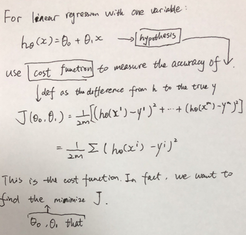

# Week1

### Why machine learning is so prevalent today?

1. Grew out of work in AI
2. New capability for computers 
3. There are lots of data can be used

在我看来，数据是重要的。如果没有这些数据做训练，再好的算法也没有用武之地。其次就是计算的能力。


---

### What is Machine Learning?

•ArthurSamuel (1959). Machine Learning: Field of study that gives computers theability to learn without being explicitly programmed. 

•TomMitchell (1998) Well-posed Learning Problem: A computer program is said to *learn* from experience E with respect to some task T and some performance measure P, if its performance on T, as measured by P, improves with experience E. 

Example: playing checkers.

E = the experience of playing many games of checkers

T = the task of playing checkers.

P = the probability that the program will win the next game.

In general, any machine learning problem can be assigned to one of two broad classifications:

Supervised learning and Unsupervised learning.

So what we're going to do in this class is actually spend a lot of time talking about how, if you actually tried to develop a machine learning system, how to **make those best practices type decisions about the way in which you build your system** so that when you're applying learning algorithm. 所以说真正的核心是理解里面的原理，然后去改装应用在自己的问题上。


---

### Supervised Learning

**right answers given** 核心就是已经知道问题的答案

In supervised learning, we are given a data set and **already know what our correct output should look like**, having the idea that there is a relationship between the input and the output.

**Supervised learning problems are categorized into "regression" and "classification" problems.** In a **regression problem, we are trying to predict results** within a continuous output, meaning that we are trying to map input variables to some continuous function. In a **classification problem, we are instead trying to predict results in a discrete output**. In other words, we are trying to map input variables into discrete categories.

**Example 1:**

Given data about the size of houses on the real estate market, try to predict their price. Price as a function of size is a continuous output, so this is a regression problem.

We could turn this example into a classification problem by instead making our output about whether the house "sells for more or less than the asking price." Here we are classifying the houses based on price into two discrete categories.

**Example 2**:

(a) Regression - Given a picture of a person, we have to predict their age on the basis of the given picture

(b) Classification - Given a patient with a tumor, we have to predict whether the tumor is malignant or benign.


---

### Unsupervised Learning

Unsupervised learning allows us to approach problems with little or no idea what our results should look like. **We can derive structure from data where we don't necessarily know the effect of the variables.**

We can derive this structure by clustering the data based on relationships among the variables in the data.

**With unsupervised learning there is no feedback based on the prediction results.**

**Example:**

Clustering: Take a collection of 1,000,000 different genes, and find a way to automatically group these genes into groups that are somehow similar or related by different variables, such as lifespan, location, roles, and so on.

Non-clustering: The "Cocktail Party Algorithm", allows you to find structure in a chaotic environment. (i.e. identifying individual voices and music from a mesh of sounds at a [cocktail party](https://en.wikipedia.org/wiki/Cocktail_party_effect)).


---

### Model Representation

**Notation**

```
m = Number of training examples
x's = "input" variable / features
y's = "output" variable / "target" variable
(x, y) = one training example
(x_i, y_i) = i-th training example
h = hypothesis

```

$h(x) = \theta_0 + \theta_1x$, is called **Linear regression with one variable, also called Univariate linear regression.**

To describe the supervised learning problem slightly more formally, our goal is, given a training set, to learn a function h : X → Y so that h(x) is a “good” predictor for the corresponding value of y. For historical reasons, this function h is called a **hypothesis**. Seen pictorially, the process is therefore like this:


When the target variable that we’re trying to predict is continuous, such as in our housing example, we call the learning problem a regression problem. When y can take on only a small number of discrete values (such as if, given the living area, we wanted to predict if a dwelling is a house or an apartment, say), we call it a classification problem.


---

### Cost Function

Cost Function is used to evaluate how our hypothesis works. For example, that will let us figure out how to fit the best possible straight line for linear regression.



We can measure the accuracy of our hypothesis function by using a **cost function**. This takes an average difference (actually a fancier version of an average) of all the results of the hypothesis with inputs from x's and the actual output y's.

$$
J(\theta_0, \theta_1) = \dfrac {1}{2m} \displaystyle \sum _{i=1}^m \left ( \hat{y}_{i}- y_{i} \right)^2 = \dfrac {1}{2m} \displaystyle \sum _{i=1}^m \left (h_\theta (x_{i}) - y_{i} \right)^2
$$

This function is otherwise called the "Squared error function", or "Mean squared error".  

We use 1/2 as a convenience for the computation of the gradient descent, as the derivative term of the square function will cancel out the 1/2. ———> ???

