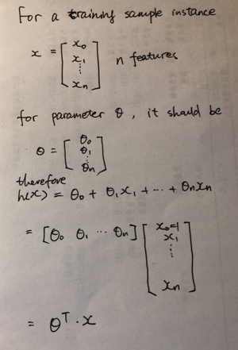
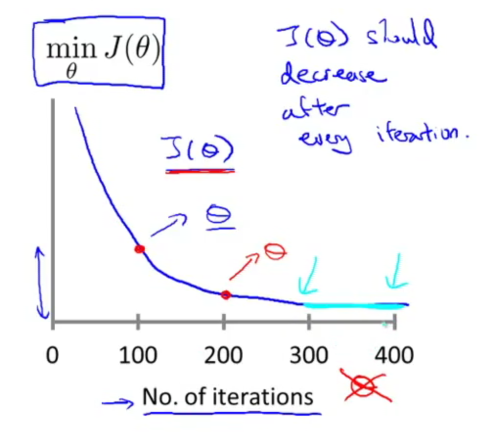
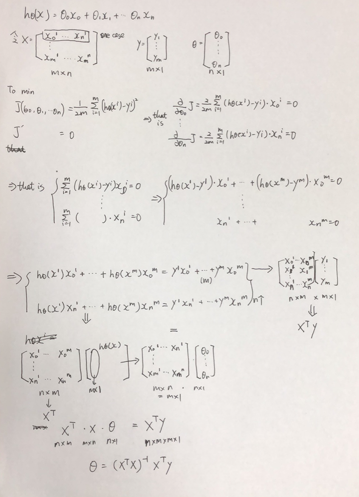

# Week2

> The course is from https://www.coursera.org/learn/machine-learning/home/welcome

### Multiple Features

Linear regression with multiple variables is also known as "multivariate linear regression".

**Notation**
$$
\begin{align*}x_j^{(i)} &= \text{value of feature } j \text{ in the }i^{th}\text{ training example} \newline x^{(i)}& = \text{the input (features) of the }i^{th}\text{ training example} \newline m &= \text{the number of training examples} \newline n &= \text{the number of features} \end{align*}
$$
The multivariable form of the hypothesis function accommodating these multiple features is as follows:
$$
h_\theta (x) = \theta_0 + \theta_1 x_1 + \theta_2 x_2 + \theta_3 x_3 + \cdots + \theta_n x_n
$$

$$
\begin{align*}h_\theta(x) =\begin{bmatrix}\theta_0 \hspace{2em} \theta_1 \hspace{2em} ... \hspace{2em} \theta_n\end{bmatrix}\begin{bmatrix}x_0 \newline x_1 \newline \vdots \newline x_n\end{bmatrix}= \theta^T x\end{align*}
$$

**Notice**, we usually write a vector as a column vector. $x \in \mathbb{R^{n+1}}$

### Gradient descent for multiple features

$$
\begin{align*}& \text{repeat until convergence:} \; \lbrace \newline \; & \theta_j := \theta_j - \alpha \frac{1}{m} \sum\limits_{i=1}^{m} (h_\theta(x^{(i)}) - y^{(i)}) \cdot x_j^{(i)} \; & \text{for j := 0...n}\newline \rbrace\end{align*}
$$

#### Feature Scaling

Make sure features are on a similar scale. The training will converge quickly.

We can speed up gradient descent by having each of our input values in roughly the same range. This is because θ will descend quickly on small ranges and slowly on large ranges, and so will oscillate inefficiently down to the optimum when the variables are very uneven.

Two techniques to help with this are **feature scaling** and **mean normalization**. Feature scaling involves dividing the input values by the range (i.e. the maximum value minus the minimum value) of the input variable, resulting in a new range of just 1. Mean normalization involves subtracting the average value for an input variable from the values for that input variable resulting in a new average value for the input variable of just zero.
$$
x_i := \dfrac{x_i - \mu_i}{s_i}
$$
Where μi is the **average** of all the values for feature (i) and si is the range of values (max - min), or si is the standard deviation.

#### Learning Rate

**Debugging gradient descent.** Make a plot with *number of iterations* on the x-axis. Now plot the cost function, J(θ) over the number of iterations of gradient descent. If J(θ) ever increases, then you probably need to decrease α.

**Automatic convergence test.** Declare convergence if J(θ) decreases by less than E in one iteration, where E is some small value such as 10−3. However in practice it's difficult to choose this threshold value. 

It has been proven that if learning rate α is sufficiently small, then J(θ) will decrease on every iteration.

To summarize:

If α is too small: slow convergence.

If α is too large: may not decrease on every iteration and thus may not converge.

### Features and Polynomial Regression

We can improve our features and the form of our hypothesis function in a couple different ways.

We can **combine** multiple features into one. For example, we can combine x1 and x2 into a new feature x3 by taking x1⋅x2.

### **Polynomial Regression**

Our hypothesis function need not be linear (a straight line) if that does not fit the data well.

We can **change the behavior or curve** of our hypothesis function by making it a quadratic, cubic or square root function (or any other form).

For example, if our hypothesis function is hθ(x)=θ0+θ1x1 then we can create additional features based on x1, to get the quadratic function hθ(x)=θ0+θ1x1+θ2x21 or the cubic function hθ(x)=θ0+θ1x1+θ2x21+θ3x31

In the cubic version, we have created new features x2 and x3 where x2=x21 and x3=x31.

To make it a square root function, we could do: hθ(x)=θ0+θ1x1+θ2x1‾‾√

One important thing to keep in mind is, if you choose your features this way then feature scaling becomes very important.

eg. if x1 has range 1 - 1000 then range of x21 becomes 1 - 1000000 and that of x31 becomes 1 - 1000000000

### Computing Parameters Analytically

Gradient descent gives one way of minimizing J. Let’s discuss a second way of doing so, this time performing the minimization explicitly and without resorting to an iterative algorithm. In the "Normal Equation" method, **we will minimize J by explicitly taking its derivatives with respect to the θj ’s, and setting them to zero.** This allows us to find the optimum theta without iteration. The normal equation formula is given below:
$$
\theta = (X^T X)^{-1}X^T y
$$

The following is a comparison of gradient descent and the normal equation:

| Gradient Descent           | Normal Equation                          |
| -------------------------- | ---------------------------------------- |
| Need to choose alpha       | No need to choose alpha                  |
| Needs many iterations      | No need to iterate                       |
| O (kn2)                    | O (n3), need to calculate inverse of XTX |
| Works well when n is large | Slow if n is very large                  |

With the normal equation, computing the inversion has complexityO(n3). So if we have a very large number of features, the normal equation will be slow. In practice, when n exceeds 10,000 it might be a good time to go from a normal solution to an iterative process.

When implementing the normal equation in octave we want to use the 'pinv' function rather than 'inv.' The 'pinv' function will give you a value of θ even if XTX is not invertible.

If XTX is **noninvertible,** the common causes might be having :

- Redundant features, where two features are very closely related (i.e. they are linearly dependent)
- Too many features (e.g. m ≤ n). In this case, delete some features or use "regularization" (to be explained in a later lesson).

Solutions to the above problems include deleting a feature that is linearly dependent with another or deleting one or more features when there are too many features.