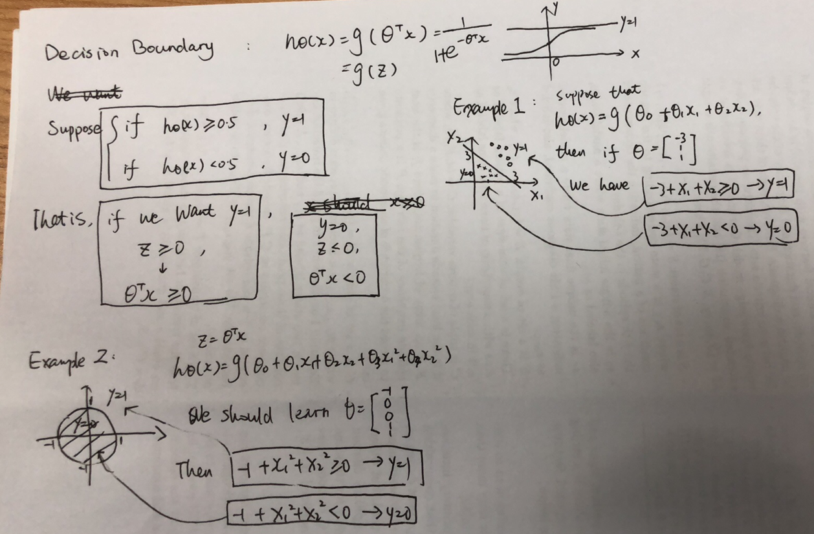
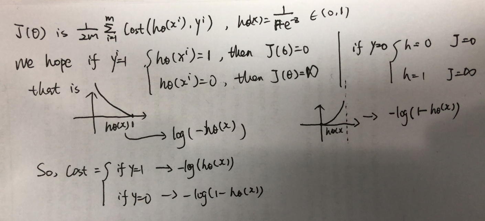
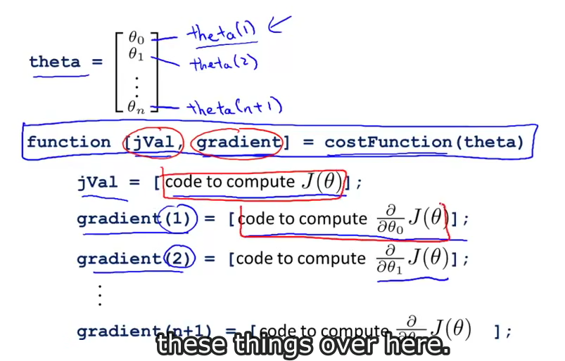

# Week3

> The course is from https://www.coursera.org/learn/machine-learning/home/welcome

### Classification

To attempt classification, one method is to use linear regression and map all predictions greater than 0.5 as a 1 and all less than 0.5 as a 0. However, this method doesn't work well because classification is not actually a linear function.

The classification problem is just like the regression problem, except that the values we now want to predict take on only a small number of discrete values. For now, we will focus on the **binary classification** **problem** in which y can take on only two values, 0 and 1. (Most of what we say here will also generalize to the multiple-class case.) 

For instance, if we are trying to build a spam classifier for email, then x(i) may be some features of a piece of email, and y may be 1 if it is a piece of spam mail, and 0 otherwise. Hence, y∈{0,1}. 0 is also called the negative class, and 1 the positive class, and they are sometimes also denoted by the symbols “-” and “+.” Given x(i), the corresponding y(i) is also called the label for the training example.

```
Classification: y = {0, 1}
Linear regression: h(x) can be any value
```


#### Hypothesis Representation

We could approach the classification problem ignoring the fact that y is discrete-valued, and use our old linear regression algorithm to try to predict y given x. However, it is easy to construct examples where this method performs very poorly. Intuitively, it also doesn’t make sense for hθ(x) to take values larger than 1 or smaller than 0 when we know that y ∈ {0, 1}. To fix this, let’s change the form for our hypotheses hθ(x) to satisfy 0≤hθ(x)≤1. This is accomplished by plugging $\theta^{T}x$ into the Logistic Function.

**Our new form uses the "Sigmoid Function," also called the "Logistic Function":**
$$
\begin{align*}& h_\theta (x) = g ( \theta^T x ) \newline \newline& z = \theta^T x \newline& g(z) = \dfrac{1}{1 + e^{-z}} \newline
	\text{that is} \newline
	& h_\theta(x) = \dfrac{1}{1+e^{-\theta^{T}x}}
\end{align*}
$$


hθ(x) will give us the **probability** that our output is 1. For example, hθ(x)=0.7 gives us a probability of 70% that our output is 1. Our probability that our prediction is 0 is just the complement of our probability that it is 1 (e.g. if probability that it is 1 is 70%, then the probability that it is 0 is 30%).
$$
\begin{align*}& h_\theta(x) = P(y=1 | x ; \theta) = 1 - P(y=0 | x ; \theta) \newline& P(y = 0 | x;\theta) + P(y = 1 | x ; \theta) = 1\end{align*}
$$


#### Decision Boundary




### Logistic Regression Model

#### Cost Function

We cannot use the same cost function that we use for linear regression because the Logistic Function will cause the output to be wavy, causing many local optima. In other words, it will not be a convex function.

Instead, our cost function for logistic regression looks like:
$$
\begin{align*}& J(\theta) = \dfrac{1}{m} \sum_{i=1}^m \mathrm{Cost}(h_\theta(x^{(i)}),y^{(i)}) \newline & \mathrm{Cost}(h_\theta(x),y) = -\log(h_\theta(x)) \; & \text{if y = 1} \newline & \mathrm{Cost}(h_\theta(x),y) = -\log(1-h_\theta(x)) \; & \text{if y = 0}\end{align*}
$$


**Note that writing the cost function in this way guarantees that J(θ) is convex for logistic regression.**
$$
\mathrm{Cost}(h_\theta(x),y) = - y \; \log(h_\theta(x)) - (1 - y) \log(1 - h_\theta(x))
\\
J(\theta) = - \frac{1}{m} \displaystyle \sum_{i=1}^m [y^{(i)}\log (h_\theta (x^{(i)})) + (1 - y^{(i)})\log (1 - h_\theta(x^{(i)}))]
\\
\begin{align*} & h = g(X\theta)\newline & J(\theta) = \frac{1}{m} \cdot \left(-y^{T}\log(h)-(1-y)^{T}\log(1-h)\right) \end{align*}
$$

#### Gradient Descent

$$
\begin{align*}& Repeat \; \lbrace \newline & \; \theta_j := \theta_j - \alpha \dfrac{\partial}{\partial \theta_j}J(\theta) \newline & \rbrace\end{align*}
$$

$$
\begin{align*} & Repeat \; \lbrace \newline & \; \theta_j := \theta_j - \frac{\alpha}{m} \sum_{i=1}^m (h_\theta(x^{(i)}) - y^{(i)}) x_j^{(i)} \newline & \rbrace \end{align*}
$$

$$
\theta := \theta - \frac{\alpha}{m} X^{T} (g(X \theta ) - \vec{y})
$$


#### Optimization

"Conjugate gradient", "BFGS", and "L-BFGS" are more sophisticated, faster ways to optimize θ that can be used instead of gradient descent. We suggest that you should not write these more sophisticated algorithms yourself (unless you are an expert in numerical computing) but use the libraries instead, as they're already tested and highly optimized.

* No need to manually pick $\alpha$
* faster
* more complex


We first need to provide a function that evaluates the following two functions for a given input value θ:

```matlab
function [jVal, gradient] = costFunction(theta)
  jVal = [...code to compute J(theta)...];
  gradient = [...code to compute derivative of J(theta)...];
end

options = optimset('GradObj', 'on', 'MaxIter', 100);
initialTheta = zeros(2,1);
   [optTheta, functionVal, exitFlag] = fminunc(@costFunction, initialTheta, options);

```



Then we can use octave's "fminunc()" optimization algorithm along with the "optimset()" function that creates an object containing the options we want to send to "fminunc()". 

We give to the function "fminunc()" our cost function, our initial vector of theta values, and the "options" object that we created beforehand.


#### Multiclass Classification

Since y = {0,1...n}, we divide our problem into n+1 (+1 because the index starts at 0) binary classification problems; in each one, we predict the probability that 'y' is a member of one of our classes.
$$
\begin{align*}& y \in \lbrace0, 1 ... n\rbrace \newline& h_\theta^{(0)}(x) = P(y = 0 | x ; \theta) \newline& h_\theta^{(1)}(x) = P(y = 1 | x ; \theta) \newline& \cdots \newline& h_\theta^{(n)}(x) = P(y = n | x ; \theta) \newline& \mathrm{prediction} = \max_i( h_\theta ^{(i)}(x) )\newline\end{align*}
$$


### Overfitting


 Without formally defining what these terms mean, we’ll say the figure on the left shows an instance of **underfitting**—in which the data clearly shows structure not captured by the model—and the figure on the right is an example of **overfitting**.

Underfitting, or high bias, is when the form of our hypothesis function h maps poorly to the trend of the data. It is usually caused by a function that is too simple or uses too few features. At the other extreme, overfitting, or high variance, is caused by a hypothesis function that fits the available data but does not generalize well to predict new data. It is usually caused by a complicated function that creates a lot of unnecessary curves and angles unrelated to the data.

This terminology is applied to both linear and logistic regression. There are two main options to address the issue of overfitting:

1) Reduce the number of features:

- Manually select which features to keep.
- Use a model selection algorithm (studied later in the course).

2) Regularization

- Keep all the features, but reduce the magnitude of parameters θj.
- Regularization works well when we have a lot of slightly useful features.

#### Cost Function

If we have overfitting from our hypothesis function, we can reduce the weight that some of the terms in our function carry by increasing their cost.

Say we wanted to make the following function more quadratic, We'll want to eliminate the influence of θ3x3 and θ4x4 . Without actually getting rid of these features or changing the form of our hypothesis
$$
\theta_0 + \theta_1x + \theta_2x^2 + \theta_3x^3 + \theta_4x^4
\\
min_\theta\ \dfrac{1}{2m}\sum_{i=1}^m (h_\theta(x^{(i)}) - y^{(i)})^2 + 1000\cdot\theta_3^2 + 1000\cdot\theta_4^2
$$


We could also regularize all of our theta parameters in a single summation as:
$$
min_\theta \dfrac{1}{2m} ( \sum_{i=1}^m (h_\theta(x^{(i)}) - y^{(i)})^2 + \lambda \sum_{j=1}^n \theta_j^2)
$$
The λ, or lambda, is the **regularization parameter**. It determines how much the costs of our theta parameters are inflated.

Using the above cost function with the extra summation, we can smooth the output of our hypothesis function to reduce overfitting. If lambda is chosen to be too large, it may smooth out the function too much and cause underfitting.

For **gradient descent**
$$
\begin{align*} & \text{Repeat}\ \lbrace \newline & \ \ \ \ \theta_0 := \theta_0 - \alpha\ \frac{1}{m}\ \sum_{i=1}^m (h_\theta(x^{(i)}) - y^{(i)})x_0^{(i)} \newline & \ \ \ \ \theta_j := \theta_j - \alpha\ \left[ \left( \frac{1}{m}\ \sum_{i=1}^m (h_\theta(x^{(i)}) - y^{(i)})x_j^{(i)} \right) + \frac{\lambda}{m}\theta_j \right] &\ \ \ \ \ \ \ \ \ \ j \in \lbrace 1,2...n\rbrace\newline & \rbrace \end{align*}
$$
The term λmθj performs our regularization. With some manipulation our update rule can also be represented as:
$$
\theta_j := \theta_j(1 - \alpha\frac{\lambda}{m}) - \alpha\frac{1}{m}\sum_{i=1}^m(h_\theta(x^{(i)}) - y^{(i)})x_j^{(i)}
$$
The first term in the above equation, 1−αλm will always be less than 1. Intuitively you can see it as reducing the value of θj by some amount on every update. Notice that the second term is now exactly the same as it was before.

What if is set to an extremely large value (perhaps for too largefor our problem,

- \-  Algorithm works fine; setting  to be very large can’t hurt it
- \-  Algortihm fails to eliminate overfitting.
- \-  Algorithm results in underfitting. (Fails to fit even training data well).
- \-  Gradient descent will fail to converge.

For **normal equation**
$$
\begin{align*}& \theta = \left( X^TX + \lambda \cdot L \right)^{-1} X^Ty \newline& \text{where}\ \ L = \begin{bmatrix} 0 & & & & \newline & 1 & & & \newline & & 1 & & \newline & & & \ddots & \newline & & & & 1 \newline\end{bmatrix}\end{align*}
$$
For logistic regression
$$
J(\theta) = - \frac{1}{m} \sum_{i=1}^m \large[ y^{(i)}\ \log (h_\theta (x^{(i)})) + (1 - y^{(i)})\ \log (1 - h_\theta(x^{(i)})) \large]
\\
J(\theta) = - \frac{1}{m} \sum_{i=1}^m \large[ y^{(i)}\ \log (h_\theta (x^{(i)})) + (1 - y^{(i)})\ \log (1 - h_\theta(x^{(i)}))\large] + \frac{\lambda}{2m}\sum_{j=1}^n \theta_j^2
$$


