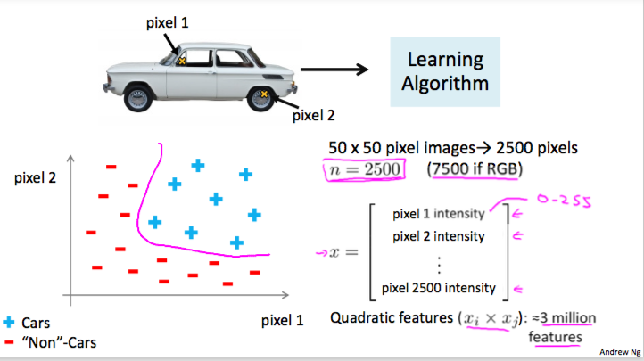
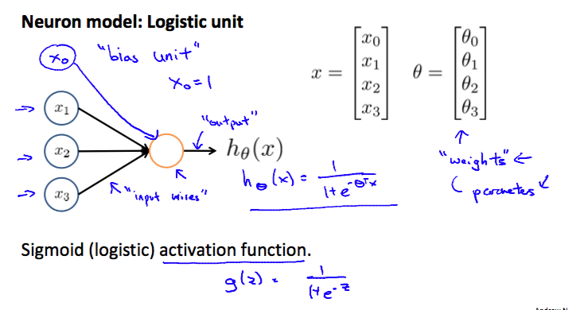
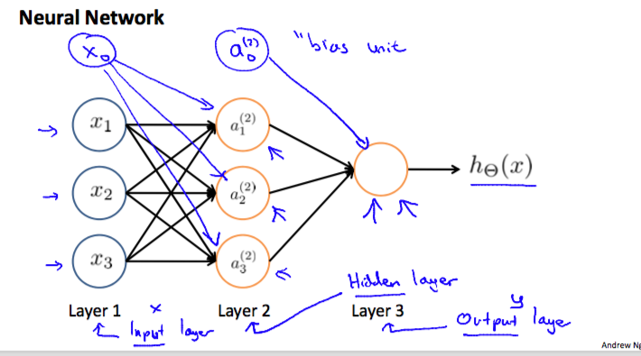
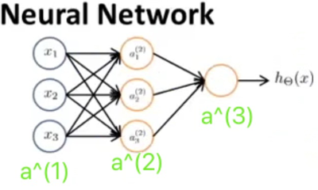
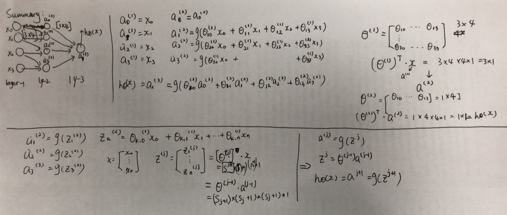
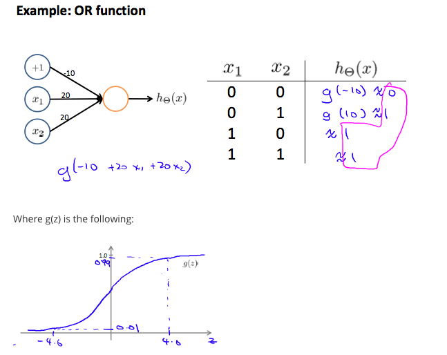
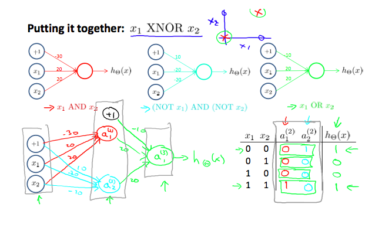

# Week4

> The course is from https://www.coursera.org/learn/machine-learning/home/welcome

### Neural Networks

If features are large, and we use linear regression. It contains lots of $x_i*x_j$ or $x_i^m*x_j^n$, which is O(n^?).

* Origins: Algorithms that try to mimic the brain.
* Was very widely used in 80s and early 90s; popularity diminished in late 90s.
* Recent resurgence: State-of-the-art technique for many applications

#### Representation

Let's examine how we will represent a hypothesis function using neural networks. At a very simple level, neurons are basically computational units that take inputs (**dendrites**) as electrical inputs (called "spikes") that are channeled to outputs (**axons**). In our model, our dendrites are like the input features x1⋯xn, and the output is the result of our hypothesis function. In this model our x0 input node is sometimes called the "bias unit." It is always equal to 1. In neural networks, we use the same logistic function as in classification, 1/1+e−θTx, yet we sometimes call it a sigmoid (logistic) **activation** function. In this situation, our "theta" parameters are sometimes called "weights".	

$$
\begin{bmatrix}x_0 \newline x_1 \newline x_2 \newline \end{bmatrix}\rightarrow\begin{bmatrix}\ \ \ \newline \end{bmatrix}\rightarrow h_\theta(x)
$$
Our input nodes (layer 1), also known as the "input layer", go into another node (layer 2), which finally outputs the hypothesis function, known as the "output layer".

We can have intermediate layers of nodes between the input and output layers called the "hidden layers." In a layer, there may be several neurons.

$$
\begin{align*}& a_i^{(j)} = \text{"activation" of unit $i$ in layer $j$} \newline& \Theta^{(j)} = \text{matrix of weights controlling function mapping from layer $j$ to layer $j+1$}\end{align*}
$$

If we had one hidden layer, it would look like:
$$
\begin{align*} a_1^{(2)} = g(\Theta_{10}^{(1)}x_0 + \Theta_{11}^{(1)}x_1 + \Theta_{12}^{(1)}x_2 + \Theta_{13}^{(1)}x_3) \newline a_2^{(2)} = g(\Theta_{20}^{(1)}x_0 + \Theta_{21}^{(1)}x_1 + \Theta_{22}^{(1)}x_2 + \Theta_{23}^{(1)}x_3) \newline a_3^{(2)} = g(\Theta_{30}^{(1)}x_0 + \Theta_{31}^{(1)}x_1 + \Theta_{32}^{(1)}x_2 + \Theta_{33}^{(1)}x_3) \newline h_\Theta(x) = a_1^{(3)} = g(\Theta_{10}^{(2)}a_0^{(2)} + \Theta_{11}^{(2)}a_1^{(2)} + \Theta_{12}^{(2)}a_2^{(2)} + \Theta_{13}^{(2)}a_3^{(2)}) \newline \end{align*}
$$
Each layer gets its own matrix of weights, Θ(j).

The dimensions of these matrices of weights is determined as follows:
$$
\text{If network has $s_j$ units in layer $j$ and $s_{j+1}$ units in layer $j+1$, then $\Theta^{(j)}$ will be of dimension $s_{j+1} \times (s_j + 1)$.}
$$
The +1 comes from the addition in Θ(j) of the "bias nodes. Example: If layer 1 has 2 input nodes and layer 2 has 4 activation nodes. Dimension of Θ(1) is going to be 4×3 where sj=2 and sj+1=4, so sj+1×(sj+1)=4×3.

#### Summary

#### Multiclass Classification

