# Notes on Formal Semantics on Programming Languages

> symbol
>
> read as
>
> semantic meaning
>
> description


[TOC]


## Background

In giving a formal semantics to a programming language we are concerned with building a mathematical model. Its purpose is to serve as a basis for understanding and reasoning about how programs behave.

Three strands of semantics of programming languages:

* Operational semantics describes the meaning of a programming language by specifying how it executes on an abstract machine.
* Denotational semantics is a technique for defining the meaning of programming languages
* Axiomatic semantics tries to fix the meaning of a programming contruct by giving proof rules for it within a program logic.

A clear operational semantics is very helpful in implementation. Axiomatic semantics for special kinds of languages can give strikingly elegant proof sys- tems, useful in developing as well as verifying programs. Denotational semantics provides the deepest and most widely applicable techniques, underpinned by a rich mathematical theory. Indeed, the different styles of semantics are highly dependent on each other.


## Convention

### For logical 

$\&$ conjunction

$\Rightarrow$ implies

$\Leftrightarrow$ iff

$\neg$ negation

$x \leq 3$ variable or place-holder

$P(x, y)$ predicate or property or relation or condition involves x and y

$\exists$ exist

$\forall$ for all

$\exists!$ unique object


### For Set

$\emptyset$ empty set

$\{x \in X \mid P(x)\}$ , comprehension, subset of X satisfy property

$\mathcal{Pow}(X) = \{ Y \mid Y \subseteq X\}$ , powerset

$\cup$ , union

$\bigcup X$ , big union, X is set of sets

$\cap$ , intersection

$\bigcap$ , big intersection

$\times$ , product

$\uplus$ , disjoin union

$\setminus$ , set difference

$\lambda$ , lambada notation

$S \circ R$ , relation composition, do R first

1-1 correspondence if  $f : X \rightarrow Y$ has an inverse $g : Y \rightarrow X$  iff g(f(x)) = x for all x in X, and f(g(y)) = y for all y in Y

$ R^+ = \bigcup_{n \in \omega} R^{n+1}$ is transitive closure, 

$R^\ast = \bigcup_{n \in \omega} R^{n+1}$ is reflexive closure.


### Operational Semantics

n range over numbers N, n is called ***metavariable*** , can be primed n' or subscripted $n_0$ 

$::=$ , read as can be

$\mid$ , read as or

$\equiv$ , identical to , build-up in exactly the same way

$\sigma : \mathbf{Loc} \rightarrow \mathbf{N}$ , function, $\sigma(X)$ is the value or contents of location X in state $

$\langle a, \sigma \rangle \rightarrow n$ , expression a waiting to be evaluated in state $\sigma$ by pair $\langle a, \sigma \rangle$, and expression a in state $\sigma$ evaluates to $n$. $\langle a, \sigma \rangle$ called arithmetic-expression *configurations*.

$$ \frac{\langle a_0, \sigma \rightarrow n_0 \rangle~~\langle a_1, \sigma \rightarrow n_1 \rangle }{\langle a_0+a_1, \sigma \rightarrow n \rangle} $$ , where n is the sum of $n_0$ and $n_1$ . The rule has a premise and a conclusion.

$\frac{}{\langle n, \sigma \rangle \rightarrow n}$  , rule with empty premises are called axioms.

$a_0 \sim a_1$ iff $(\forall n \in \mathbf{N} \forall \sigma \in \Sigma. \langle a_0, \sigma \rangle \rightarrow \Rightarrow \langle a_1, \sigma \rangle \rightarrow n)$ , expression equivalent

$\langle X := 5, \sigma \rangle \rightarrow \sigma[5/X]$ means the state obtained from $\sigma$ replacing its content in X by 5.

$\langle a, \sigma \rangle \rightarrow_{1} \langle a', \sigma' \rangle$  to mean one step in the evaluation of a in state $\sigma$ yields a' and $\sigma'$ 


### Induction

* $(~P(0) ~~\&~~ (\forall m \in \omega. P(m) \Rightarrow P(m+1))~) \Rightarrow \forall n \in \omega. P(n)$ *basis* , *induction step* , P(m) assertion called *induction hypothesis* 

* $\langle a, \sigma \rangle \rightarrow m \& \langle a, \sigma \rangle \rightarrow m' \Rightarrow  m = m'$  says the evaluation of arithmetic expression in IMP is deterministic.

* When $a \prec b$ we say a is predecessor of b.

* $d \Vdash_R y$ to mean d is an R-derivation of y, where R is a set of rule instances, instance written as (X/y) where X is a finite set called premises and y is an element called conclusion
  $$
  \begin{cases}
  (\emptyset/y) \Vdash_R y,& \text{if } (\emptyset/y) \in R \\
  (\{ d_1, \dots, d_n \}/y) \Vdash_R y,& \text{if } (\{ x_1, \dots, x_n \}/y) \in R ~\&~ d_1 \Vdash_R x_1 \& \dots \& d_n \Vdash_R x_n
  \end{cases}
  $$


### Denotational Semantics

The command c is said to denote $\mathcal{C} [[c]] $ and  $\mathcal{C} [[c]] $  is said to be a denotation of c.

 We shall use the brackets [[]] round an argument of a semantic function to show that the argument is a piece of syntax. That is c is a piece of syntax.

We can see, for operational semantics, it is based on syntax and defined by rules. For denotational semantics, it is based on high level abstraction. Write as functions.

$ \hat{R}(B) = \{ y \mid \exists (X/y) \in R. X \subseteq B \}$ , R is a set of rule instance (X/y), $\hat{R}$ is an operator on sets, B is a set, $\hat{R}(B)$ results in a set. $\hat{R}$ has a least fixed point 
$$
fix(\hat{R}) =_{def} \bigcup_{n \in \omega} \hat{R}^n(\emptyset)
$$

$(P, \sqsubseteq)$ , partial order

$\bigsqcup X$ , subset X of a partial order has a least upper bound

\bigsqcap $\sqcap$, has a greatest lower bound

$(D, \sqsubseteq_D)$ , complete partial order, if it has least upper bound for all $\omega$-chains , $\sqsubseteq$ called ordering, $\bot$ is bottom

$ fix(f) = \bigsqcup_{n \in \omega} f^n(\bot)$ , is a fixed point of $f: D \rightarrow D$ , which is a continuous function on D, which is a cpo with bottom 


### Axiomatic Semantics

*invariant* , assertion I, that remains true under each step

$\{ A \}c\{B\}$ , *partial correctness assertions* , because they say nothing about the command c if it fails to terminate. where A and B are assertions and c is a command, for all states which satisfy A if the execution c from state terminates in a', the a' satisfies B.

$[A]c[B]$ states will terminate

$\sigma \models A $ , the state satisfies assertion A

*bound and free variables* , We sayan occurrence of an integer variable i in an assertion is bound if it occurs in the scope of an enclosing quantifier $\exists i $  or $\forall i$ If it is not bound we say it is free.

***interpretation*** is a function which assigns an integer to each integer variable 
$I : \mathbf{Intvar} \rightarrow \mathbf{N}$ 

$\mathcal{Av} [[a]]I\sigma$ , a ***semantic function*** Av which gives the value associated with an arithmetic expression with integer variables in a particular state in a particular interpretation

$I[n/i]$ to mean the interpretation got from interpretation I by changing  the value for integer-variable i to n, 
$$
I[n/i](j) = 
\begin{cases}

	n & \text{if} j \equiv i , \\
	I(j) & \text{otherwise}.
\end{cases}
$$

*validity* , $\models \{ A\}c\{B\}$ mean for all interpretations I and all states are true.

## Set Theory

### Logical Notation

For statements or assertions $A, B$ 

* $A \& B$ , A and B, conjunction of A and B
* $A \Rightarrow B$ , A implies B, if A then B
* $A\Leftrightarrow B$ , A if and only if B, logical equivalence of A and B
* $A ~or ~B$ , A or B, disjunction of A and B
* $\neg A$ , negation, true iff A is false
* $(x \leq 3) \& (y \leq7)$ , variables or unknowns or place-holders
* $P(x, y)$ , involves variables x, y is called a predicate or property or relation or condition, and it only becomes true or false when the pair x, y stand for particular things.
* $\exists x. P(x)$ , there exists x such that P(x)
* $\forall x.P(x)$ , for all x P(x)
* $\forall x \in X. P(x)$ , quantifier $\forall $ ranges over a set X, $\forall x. x \in X \Rightarrow P(x)$
* $\exists!x. P(x)$ , *unique* object satisfying $P(x)$ 
* ​

### Sets

Intuitively, a set is an (unordered) collection of objects, called its *elements* or *members*.

* $x \in X$ , a is an element of the set X

* $\{a, b, c, \cdots\}$ , set of elements a, b, c

* $X \subseteq Y$ , subset of Y

* $X = Y$ , X and Y are equal

* $X = \{x \mid P(x)\}$ , set X has as elements precisely all those x for which P(x) is true

* $\emptyset$ , null or empty set

* $\omega$ , set of natural numbers

* $\{x \in X \mid P(x)\}$ , comprehension, subset of X consisting of all elements x of X which satisfy P(X) 

  $\{e(x_1, \dots,x_n) \mid x_1 \in X_1, \& \dots \& x_n \in X_n \& P(x_1, \dots , x_n)\}$   e is some expression

* $\mathcal{Pow}(X) = \{ Y \mid Y \subseteq X\}$ , powerset

* $\{ x_i \mid i \in I \}$ , for all i in I, there is a unique object $x_i$, maybe a set itself. Then in this set, xi are said to be indexed by the elements i in I.

* $X \cup Y = \{ a \mid a \in X ~or~ a \in Y \}$ , union

* $\bigcup X = \{ a \mid \exists x \in X. ~ a \in x \}$ , bigunion, X is set of sets

* $X \cap Y = \{ a \mid a \in X ~and~ a \in Y \}$ , intersection

* $\bigcap X = \{ a \mid \forall x \in X. ~ a \in x \}$ , big intersection, X is set of sets

* $X \times Y = \{ (a, b) \mid a \in X \& b \in Y \}$ , product, where $(a, b)$ is ordered pair or 2-tuples

* $ X_0 \uplus \dots \uplus X_n  = ( \{ 0 \} \times X_0) \cup \dots \cup ( \{ n \} \times X_n )$ , disjoint union, making copies of the elements from different sets forced to be distinct.

* $ X \setminus Y = \{ x \mid x \in X ~\&~ x \notin Y \} $ , set difference


### Relations and Functions

**A binary relation** between X and Y is an element of Pow(X x Y), and so a subset of pairs in the relation. When R is a relation R X x Y we shall often write xRy for (x,y) in R.

```
that is for all (x,y) in R, xRy is satisfied
```

f(x) is **defined**, when there is y that (x,y) in f, write as f(x) = y, also called total function

if exists x, f(x) is unknown, f(x) is partial function

if f(x) from X to Y is a relation $f \subseteq X \times Y$ , $ \forall x, y,y'. (x, y) \in f ~\&~ (x,y') \in f \Rightarrow y = y' $ .

```
that is f(x) is partial function, then if all x has a defined f(x), f is defined also called total function.

if f is a relation from X to Y, it has to satisfy for same x, there is only a single y.
```

**lambda notation** is useful to describe functions, a way to refer to functions without having to name it.

$\lambda x \in X.~e = \{ (x, e) \mid x \in X \}$  , such as $\lambda x \in \omega.~(x+1)$ is the successor function

$S \circ R$ is composing relations, which calculate R first

A function $f : X \rightarrow Y$ has an inverse $g : Y \rightarrow X$ iff g(f(x)) = x for all x in X, and f(g(y)) = y for all y in Y. Then the sets X and Y are said to be in 1-1 correspondence.

Let R be a relation on a set X. Define $R^{0} = Id_X$ , the identity relation on the set X, $R^1 = R$ and assuming $R^n$ is defined, $R^{n+1} = R \circ R^n$ . $ R^+ = \bigcup_{n \in \omega} R^{n+1}$ is transitive closure, $R^\ast = \bigcup_{n \in \omega} R^{n+1}$ is reflexive closure.


## Operational Semantics

### IMP a simple imperative language

Formally, IMP's behaviour is described by rules which specify how its expressions are evaluated and its commands are executed.

### Defination

* $\mathbf{N}$ , numbers
* $\mathbf{T = \{ true, false\} }$ , truth values
* $\mathbf{Loc}$ , locations
* $\mathbf{Aexp} ::= n \mid X \mid a_0 + a_1 \mid a_0 - a_1 \mid a_0 \times a_1$ , arithmetic expressions
* $\mathbf{Bexp} ::= \mathbf{true} \mid \mathbf{false} \mid a_0 = a_1 \mid a_0 \leq a_1 \mid \neg b \mid  b_0 \lor b_1 \mid b_0 \land b_1$ , boolean expressions
* $\mathbf{Com} ::= \mathbf{skip} \mid X := a \mid c_0 ; a_1 \mid \mathbf{if} ~b~ \mathbf{then} ~c_0~ \mathbf{else} ~c_1` \mid \mathbf{while} ~b~ \mathbf{do} ~c$ , commands
* n, X, a, b, c is called *metavariable* , range over the syntactic categories can be primed or subscripted like X'


### Arithmetic Expression

Underlying most models is an idea of state determined by what contents are in the locations. With respect to a state, an arithmetic expression evaluates to an integer and a boolean expression evaluates to a truth value. The resulting values can influence the execution of commands which will lead to changes in state.

*  $\Sigma$ , set of states
*  $\sigma : \mathbf{Loc} \rightarrow \mathbf{N}$ , function, $\sigma(X)$ is the value or contents of location X in state $\sigma$
*  $\langle a, \sigma \rangle \rightarrow n$ , expression a waiting to be evaluated in state $\sigma$ by pair $\langle a, \sigma \rangle$, and expression a in state $\sigma$ evaluates to $n$. $\langle a, \sigma \rangle$ called arithmetic-expression *configurations*.
*  $a_0 \sim a_1$ iff $(\forall n \in \mathbf{N} \forall \sigma \in \Sigma. \langle a_0, \sigma \rangle \rightarrow \Rightarrow \langle a_1, \sigma \rangle \rightarrow n)$ 


​		
All three relations are examples of the general notion of transition relations, or transition systems, in which the configurations are thought of as some kind of state and the relations as expressing possible transitions, or changes, between states.


#### Rules

$\langle n, \sigma \rangle \rightarrow n$ 
$\langle X, \sigma \rangle \rightarrow \sigma(X)$
$$ \frac{\langle a_0, \sigma \rightarrow n_0 \rangle~~\langle a_1, \sigma \rightarrow n_1 \rangle }{\langle a_0+a_1, \sigma \rightarrow n \rangle} $$ , where n is the sum of $n_0$ and $n_1$ . The rule has a premise and a conclusion.
$\frac{}{\langle n, \sigma \rangle \rightarrow n}$  , rule with empty premises are called axioms.

A rule instance is obtained by instantiating these to particular numbers, locations and expressions and states.


We call such a structure a derivation tree or simple a derivation.

In general, we write $\langle a, \sigma \rangle \rightarrow n$, and say a in $\sigma$ evaluates to n, iff it can be derived from the rules for the evaluation of arithmetic expressions.

In this way the rules provide an algorithm for the evaluation of arithmetic expressions based on the search for a derivation tree. Because it can be implemented fairly directly the rules specify the meaning, or semantics, of arithmetic expressions in an operational way, and **the rules are said to give an operational semantics of such expressions.** 

The style of semantics we have chosen is one which is becoming prevalent however. It is one which is often called structural operational semantics because of the syntax-directed way in which the rules are presented. It is also called natural semantics because of the way derivations resemble proofs in natural deduction-a method of constructing formal proofs.


### Boolean expression

#### Rules


### Commands

The role of expressions is to evaluate to values in a particular state. The role of a program, and so commands, is to execute to change the state. 

A pair <c, a> represents the (command) configuration from which it remains to execute command c from state a. 

$\langle c, \sigma \rightarrow \sigma' \rangle$ , means the full execution of command c in state $\sigma$ terminates in final state $\sigma'$ 

$\langle X := 5, \sigma \rangle \rightarrow \sigma[5/X]$ means the state obtained from $\sigma$ replacing its content in X by 5.


### Alternative semantics

$\langle a, \sigma \rangle \rightarrow_{1} \langle a', \sigma' \rangle$  to mean one step in the evaluation of a in state $\sigma$ yields a' and $\sigma'$ 

For example:

$\langle X := 5; Y:=1, \sigma \rangle \rightarrow_1 \langle Y:=1, \sigma[5/X] \rangle \rightarrow_1 \sigma[5/X][1/Y] $. 


## Induction

### Mathematical induction

$(~P(0) ~~\&~~ (\forall m \in \omega. P(m) \Rightarrow P(m+1))~) \Rightarrow \forall n \in \omega. P(n)$

*basis* , *induction step* , P(m) assertion called *induction hypothesis* 


In showing a property Q(m) holds inductively of all numbers m, it might be that the property's truth at m + 1 depends not just on its truth at the predecessor m but on its truth at other numbers preceding m as well.

Use *course-of-values induction* , to help out (**the past course of truths all the way back to ** $n_0$ and not just the immediately previous step , That is, we show truth flows from an historical trend

For example, Every integer n greater than 1 has a factorization into primes.

$(~\forall m \in \omega. ~(\forall k < m. Q(k)) \Rightarrow Q(m)~) \Rightarrow \forall n \in \omega. Q(n)$			


### Structural induction

$\langle a, \sigma \rangle \rightarrow m \& \langle a, \sigma \rangle \rightarrow m' \Rightarrow  m = m'$  says the evaluation of arithmetic expression in IMP is deterministic.


Let $P(a)$ be a property of arithmetic expressions a. To show P(a) holds for all arithmetic expressions a it is sufficient to show:

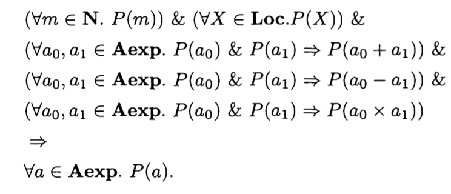


The P(a) is *induction hypothesis* , The principle says that in order toshow the induction hypothesis is true of all arithmetic expressions it suffices to show thatit is true of atomic expressions and is preserved by all the methods of forming arithmeticexpressions.

​		

### Well-founded induction

Mathematical and structural induction are special cases of a general and powerful proof principle called well-founded induction.
If a property fails to hold of any expression then it must fail on some minimal expression which when it is broken down yields subexpressions, all of which satisfy the property. 
This is the feature required of a relation if it is to support well-founded induction.

#### Definition:

A well-founded relation is a binary relation $\prec$ on a set A such that there are no infinite desending chains $\dots \prec a_i \prec \dots \prec a_1 \prec a_0$. When $a \prec b$ we say a is predecessor of b.

```
That is ensure there is not a chain which is infinite desending. Basically, elements may be on different chains. Like this:
*   *   *
 \ / \ /
  *   *
See proposition
```

#### Proposition

So, Let $\prec$  be a binary relation on a set A. The relation $\prec$ is well-founded iff any nonempty subset Q of A has a minimal element, an element m such that
$$
m \in Q ~\&~ \forall b \prec m.~b \notin Q.
$$
#### The principle of well-founded induction

 Let $\prec$  be a well founded relation on a set A. Let P be a property. Then $\forall a \in A. P(a)$

iff 
$$
\forall a \in A. ( [\forall b \prec a. P(b)] \Rightarrow P(a))
$$
The principle says that to prove a property holds of all elements of a well-founded set it suffices to show that if the property holds of all predecessors of an arbitrary element a then the property holds of a.

Proposition  provides an alternative to proofs by well-founded induction. Suppose A is a well-founded set. Instead of using well-founded induction to show every element of A satisfies a property P, we can consider the subset of A which the property P fails, i.e. the subset F of counterexamples. By Proposition 3.7, to show F is $\emptyset$ it is sufficient to show that F cannot have a minimal element.

Well-founded induction is the most important principle in proving the termination of programs. Uncertainties about termination arise because of loops or recursions in a program. If it can be shown that execution of a loop or recursion in a program decreases the value in a well-founded set then it must eventually terminate.


### Induction on derivations

Structural induction alone is often inadequate to prove properties of operational seman- tics. Often it is useful to do induction on the structure of derivations.

A derivation of an element x takes the form of a tree which is either an instance of an axiom or of the formwhich includes derivations of xI, ... ,Xn , the premises of a rule instance with conclusion X. 

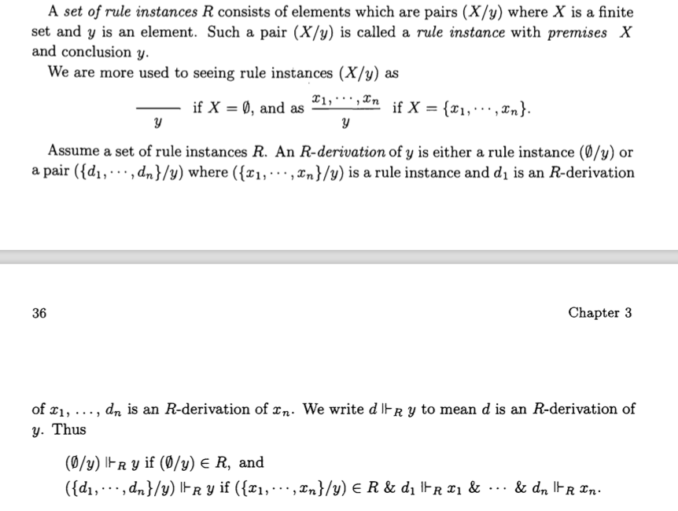

Let d, d' be derivations. 
Say d' is an immediate subderivation of d, written d' $\prec_1$ d, iff d has the form (D/y) with d' in D. 
Write $\prec$ for the transitive closure of $\prec_1$ , $\prec = \prec^+$ . We say d' is a subderivation of d iff d' $\prec$ d.


## Denotational Semantics

The transitions built out of the syntax makes it hard to compare two programs written in different programming language. Therefore, we need denotational semantics.

For example, $c_0 \sim c_1 \text{iff} (\forall \sigma, \sigma'. \langle c_0, \sigma \rangle \rightarrow \sigma' \iff \langle c_1, \sigma \rangle \rightarrow \sigma') $ . In other words, c0 ~ c1 iff  Co and Cl determine the same partial function on states. This suggests we should define the meaning, or semantics, of IMP at a more abstract level in which we take the denotation of a command to be a partial function on states.

The brackets [[ ]] (\llbracket) are traditional in denotational semantics. The square brackets [[a]] put the arithmetic expression a in quotes so we don't evaluate a. We could have written e.g. A( "3 + 5")$\sigma$ = 8 instead of A[[3 + 5]]$\sigma$ = 8. 		
So the brackets [[ ]] do not represent true and complete quotation. We shall use the brackets [[]] round an argument of a semantic function to show that the argument is a piece of syntax.

We define the semantic functions by structural induction.
$$
\mathcal{A} : \mathbf{Aexp} \rightarrow (\Sigma \rightarrow \mathbf{N}) \\
\mathcal{B} : \mathbf{Bexp} \rightarrow (\Sigma \rightarrow \mathbf{T}) \\
\mathcal{C} : \mathbf{Com} \rightarrow (\Sigma \rightarrow \Sigma) \\
$$
So, $\mathcal{A}$ is a function from arithmetic expressions to $\Sigma \rightarrow \mathbf{N}$	. 

Also, $a \in \mathcal{A}, \mathcal{A}[[a]] : \Sigma \rightarrow \mathbf{N}$ is a function.

The command c is said to denote $\mathcal{C} [[c]] $ and  $\mathcal{C} [[c]] $  is said to be a denotation of c.

### Denotations of Aexp

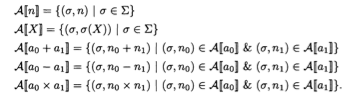

### Denotations of Bexp

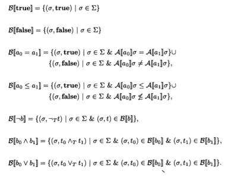

### Denotations of Com

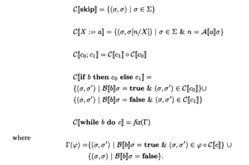

Here is a problem.

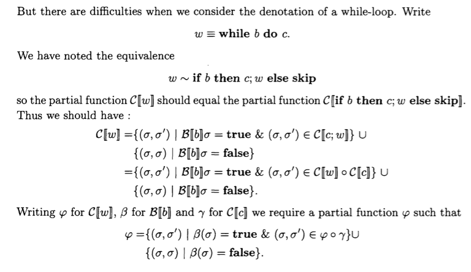

This involves $\varphi$ on both sides of the equation. Then we can regard $\Gamma$ , where

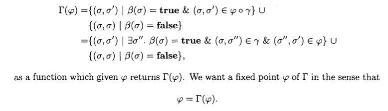


### Partial Order

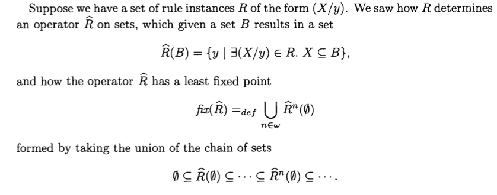


#### Partial order

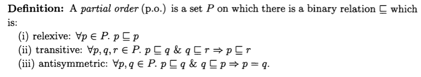


#### Least upper bound (lub)

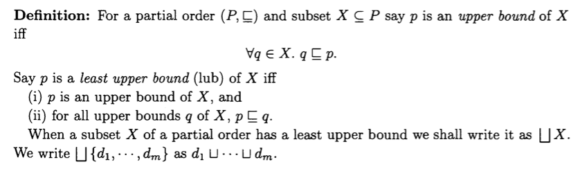


#### Complete partial order (cpo)

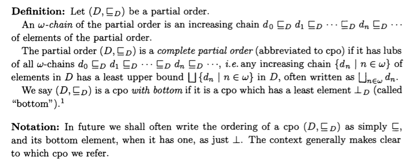


#### Monotonic

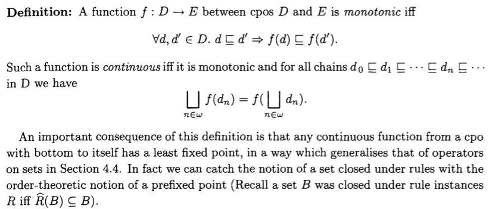


#### Fixed point

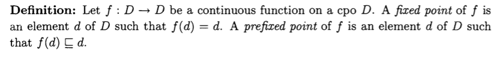


#### Greatest lower bound (glb)

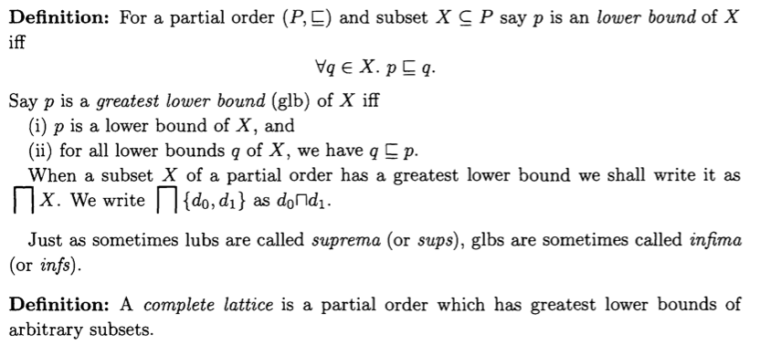


#### Complete Lattice

#### Knaster-Tarski Theorem


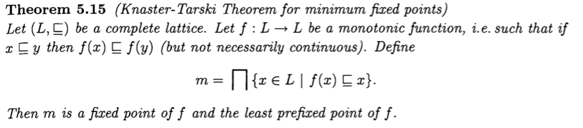


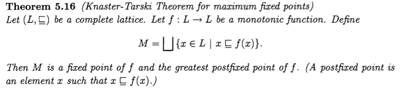


## Axiomatic Semantics

We turn to consider the problem of how to prove that a program we have written in IMP does what we require of it.

We need to be a little more clever, and abstract, and use some logic to reason about the program.

Historically R.W.Floyd invented rules for reasoning about flow charts, and later C.A.R.Hoare modified and extended these to give a treatment of a language like IMP but with procedures. Originally their approach was advocated not just for proving properties of programs but also as giving a method for explaining the meaning of program constructs; the meaning of a construct was specified in terms of "axioms" (more accurately rules) saying how to prove properties of it. For this reason, the approach is traditionally called axiomatic semantics.

The assertion I is called an invariant of the while-loop because it remains true under each iteration of the loop. So finally when the loop terminates I will hold at the end.

$\{ A \}c\{B\}$ , partial correctness assertions , where A and B are assertions and c is a command, for all states which satisfy A if the execution c from state terminates in a', the a' satisfies B.
$ \forall \sigma. ( \sigma \models A ~\&~ \mathcal{C} [[c]] \sigma \text{ is defined}) \Rightarrow \mathcal{C}[[c]]\sigma ~ \models ~ B $


### Assn the aseertion language

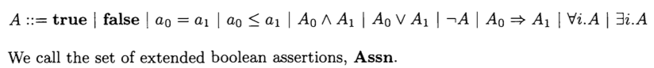

​		
We sayan occurrence of an integer variable i in an assertion is bound if it occurs in the scope of an enclosing quantifier $\exists i $  or $\forall i$ If it is not bound we say it is free.


### Semantics of assertions

interpretation is a function which assigns an integer to each integer variable 
$I : \mathbf{Intvar} \rightarrow \mathbf{N}$ 

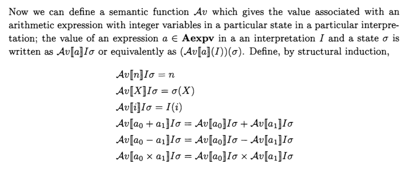


### Proof rules for partial correctness

The proof rules are syntax-directed; the rules reduce proving a partial correctness assertion of a compound command to proving partial correctness assertions of its immediate subcom- mands. The proof rules are often called Hoare rules and the proof system, consisting of the collection of rules, Hoare logic.

In this context the Hoare rules are thought of as a proof system, derivations are called proofs and any conclusion of a derivation a theorem. We shall write |- {A}c{B} when {A}c{B} is a theorem.

### Soundness

Soundness: Every rule should preserve validity, in the sense that if the assumptions in the rule's premise is valid then so is its conclusion. When this holds of a rule it is called sound. When every rule of a proof system is sound, the proof system itself is said to be sound.

Completeness: Naturally we would like the proof system to be strong enough so that all valid partial correctness assertions can be obtained as theorems. We would like the proof system to be complete in this sense. 