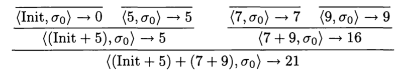
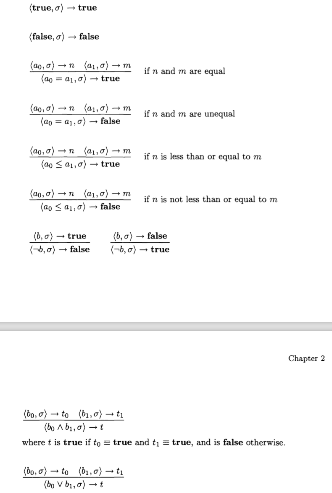
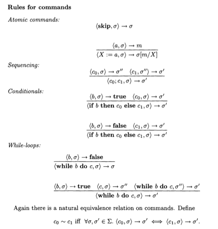

# Notes on Formal Semantics on Programming Languages

> symbol
>
> read as
>
> semantic meaning
>
> description

[TOC]

## Background

In giving a formal semantics to a programming language we are concerned with building a mathematical model. Its purpose is to serve as a basis for understanding and reasoning about how programs behave.

Three strands of semantics of programming languages:

* Operational semantics describes the meaning of a programming language by specifying how it executes on an abstract machine.
* Denotational semantics is a technique for defining the meaning of programming languages
* Axiomatic semantics tries to fix the meaning of a programming contruct by giving proof rules for it within a program logic.

A clear operational semantics is very helpful in implementation. Axiomatic semantics for special kinds of languages can give strikingly elegant proof sys- tems, useful in developing as well as verifying programs. Denotational semantics provides the deepest and most widely applicable techniques, underpinned by a rich mathematical theory. Indeed, the different styles of semantics are highly dependent on each other.

## Convention

#### For logical 

$\&$ conjunction

$\Rightarrow$ implies

$\Leftrightarrow$ iff

$\neg$ negation

$x \leq 3$ variable or place-holder

$P(x, y)$ predicate or property or relation or condition involves x and y

$\exists$ exist

$\forall$ for all

$\exists!$ unique object

#### For Set

$\emptyset$ empty set

$\{x \in X \mid P(x)\}$ , comprehension, subset of X satisfy property

$\mathcal{Pow}(X) = \{ Y \mid Y \subseteq X\}$ , powerset

$\cup$ , union

$\bigcup X$ , big union, X is set of sets

$\cap$ , intersection

$\bigcap$ , big intersection

$\times$ , product

$\uplus$ , disjoin union

$\setminus$ , set difference

$\lambda$ , lambada notation

$S \circ R$ , relation composition, do R first

1-1 correspondence if  $f : X \rightarrow Y$ has an inverse $g : Y \rightarrow X$  iff g(f(x)) = x for all x in X, and f(g(y)) = y for all y in Y

$ R^+ = \bigcup_{n \in \omega} R^{n+1}$ is transitive closure, 

$R^\ast = \bigcup_{n \in \omega} R^{n+1}$ is reflexive closure.

#### Operational Semantics

n range over numbers N, n is called ***metavariable*** , can be primed n' or subscripted $n_0$ 

$::=$ , read as can be

$\mid$ , read as or

$\equiv$ , identical to , build-up in exactly the same way

$\sigma : \mathbf{Loc} \rightarrow \mathbf{N}$ , function, $\sigma(X)$ is the value or contents of location X in state $

$\langle a, \sigma \rangle \rightarrow n$ , expression a waiting to be evaluated in state $\sigma$ by pair $\langle a, \sigma \rangle$, and expression a in state $\sigma$ evaluates to $n$. $\langle a, \sigma \rangle$ called arithmetic-expression *configurations*.

$$ \frac{\langle a_0, \sigma \rightarrow n_0 \rangle~~\langle a_1, \sigma \rightarrow n_1 \rangle }{\langle a_0+a_1, \sigma \rightarrow n \rangle} $$ , where n is the sum of $n_0$ and $n_1$ . The rule has a premise and a conclusion.

$\frac{}{\langle n, \sigma \rangle \rightarrow n}$  , rule with empty premises are called axioms.

$a_0 \sim a_1$ iff $(\forall n \in \mathbf{N} \forall \sigma \in \Sigma. \langle a_0, \sigma \rangle \rightarrow \Rightarrow \langle a_1, \sigma \rangle \rightarrow n)$ , expression equivalent

$\langle X := 5, \sigma \rangle \rightarrow \sigma[5/X]$ means the state obtained from $\sigma$ replacing its content in X by 5.

$\langle a, \sigma \rangle \rightarrow_{1} \langle a', \sigma' \rangle$  to mean one step in the evaluation of a in state $\sigma$ yields a' and $\sigma'$ 

## Set Theory

### Logical Notation

For statements or assertions $A, B$ 

* $A \& B$ , A and B, conjunction of A and B
* $A \Rightarrow B$ , A implies B, if A then B
* $A\Leftrightarrow B$ , A if and only if B, logical equivalence of A and B
* $A ~or ~B$ , A or B, disjunction of A and B
* $\neg A$ , negation, true iff A is false
* $(x \leq 3) \& (y \leq7)$ , variables or unknowns or place-holders
* $P(x, y)$ , involves variables x, y is called a predicate or property or relation or condition, and it only becomes true or false when the pair x, y stand for particular things.
* $\exists x. P(x)$ , there exists x such that P(x)
* $\forall x.P(x)$ , for all x P(x)
* $\forall x \in X. P(x)$ , quantifier $\forall $ ranges over a set X, $\forall x. x \in X \Rightarrow P(x)$
* $\exists!x. P(x)$ , *unique* object satisfying $P(x)$ 

### Sets

Intuitively, a set is an (unordered) collection of objects, called its *elements* or *members*.

* $x \in X$ , a is an element of the set X

* $\{a, b, c, \cdots\}$ , set of elements a, b, c

* $X \subseteq Y$ , subset of Y

* $X = Y$ , X and Y are equal

* $X = \{x \mid P(x)\}$ , set X has as elements precisely all those x for which P(x) is true

* $\emptyset$ , null or empty set

* $\omega$ , set of natural numbers

* $\{x \in X \mid P(x)\}$ , comprehension, subset of X consisting of all elements x of X which satisfy P(X) 

  $\{e(x_1, \dots,x_n) \mid x_1 \in X_1, \& \dots \& x_n \in X_n \& P(x_1, \dots , x_n)\}$   e is some expression

* $\mathcal{Pow}(X) = \{ Y \mid Y \subseteq X\}$ , powerset

* $\{ x_i \mid i \in I \}$ , for all i in I, there is a unique object $x_i$, maybe a set itself. Then in this set, xi are said to be indexed by the elements i in I.

* $X \cup Y = \{ a \mid a \in X ~or~ a \in Y \}$ , union

* $\bigcup X = \{ a \mid \exists x \in X. ~ a \in x \}$ , bigunion, X is set of sets

* $X \cap Y = \{ a \mid a \in X ~and~ a \in Y \}$ , intersection

* $\bigcap X = \{ a \mid \forall x \in X. ~ a \in x \}$ , big intersection, X is set of sets

* $X \times Y = \{ (a, b) \mid a \in X \& b \in Y \}$ , product, where $(a, b)$ is ordered pair or 2-tuples

* $ X_0 \uplus \dots \uplus X_n  = ( \{ 0 \} \times X_0) \cup \dots \cup ( \{ n \} \times X_n )$ , disjoint union, making copies of the elements from different sets forced to be distinct.

* $ X \setminus Y = \{ x \mid x \in X ~\&~ x \notin Y \} $ , set difference

### Relations and Functions

**A binary relation** between X and Y is an element of Pow(X x Y), and so a subset of pairs in the relation. When R is a relation R X x Y we shall often write xRy for (x,y) in R.

```
that is for all (x,y) in R, xRy is satisfied
```

f(x) is **defined**, when there is y that (x,y) in f, write as f(x) = y, also called total function

if exists x, f(x) is unknown, f(x) is partial function

if f(x) from X to Y is a relation $f \subseteq X \times Y$ , $ \forall x, y,y'. (x, y) \in f ~\&~ (x,y') \in f \Rightarrow y = y' $ .

```
that is f(x) is partial function, then if all x has a defined f(x), f is defined also called total function.

if f is a relation from X to Y, it has to satisfy for same x, there is only a single y.
```

**lambda notation** is useful to describe functions, a way to refer to functions without having to name it.

$\lambda x \in X.~e = \{ (x, e) \mid x \in X \}$  , such as $\lambda x \in \omega.~(x+1)$ is the successor function

$S \circ R$ is composing relations, which calculate R first

A function $f : X \rightarrow Y$ has an inverse $g : Y \rightarrow X$ iff g(f(x)) = x for all x in X, and f(g(y)) = y for all y in Y. Then the sets X and Y are said to be in 1-1 correspondence.

Let R be a relation on a set X. Define $R^{0} = Id_X$ , the identity relation on the set X, $R^1 = R$ and assuming $R^n$ is defined, $R^{n+1} = R \circ R^n$ . $ R^+ = \bigcup_{n \in \omega} R^{n+1}$ is transitive closure, $R^\ast = \bigcup_{n \in \omega} R^{n+1}$ is reflexive closure.

## Operational Semantics

### IMP a simple imperative language

Formally, IMP's behaviour is described by rules which specify how its expressions are evaluated and its commands are executed.

### Defination

* $\mathbf{N}$ , numbers
* $\mathbf{T = \{ true, false\} }$ , truth values
* $\mathbf{Loc}$ , locations
* $\mathbf{Aexp} ::= n \mid X \mid a_0 + a_1 \mid a_0 - a_1 \mid a_0 \times a_1$ , arithmetic expressions
* $\mathbf{Bexp} ::= \mathbf{true} \mid \mathbf{false} \mid a_0 = a_1 \mid a_0 \leq a_1 \mid \neg b \mid  b_0 \lor b_1 \mid b_0 \land b_1$ , boolean expressions
* $\mathbf{Com} ::= \mathbf{skip} \mid X := a \mid c_0 ; a_1 \mid \mathbf{if} ~b~ \mathbf{then} ~c_0~ \mathbf{else} ~c_1` \mid \mathbf{while} ~b~ \mathbf{do} ~c$ , commands
* n, X, a, b, c is called *metavariable* , range over the syntactic categories can be primed or subscripted like X'


### Arithmetic Expression

Underlying most models is an idea of state determined by what contents are in the locations. With respect to a state, an arithmetic expression evaluates to an integer and a boolean expression evaluates to a truth value. The resulting values can influence the execution of commands which will lead to changes in state.

*  $\Sigma$ , set of states
*  $\sigma : \mathbf{Loc} \rightarrow \mathbf{N}$ , function, $\sigma(X)$ is the value or contents of location X in state $\sigma$
*  $\langle a, \sigma \rangle \rightarrow n$ , expression a waiting to be evaluated in state $\sigma$ by pair $\langle a, \sigma \rangle$, and expression a in state $\sigma$ evaluates to $n$. $\langle a, \sigma \rangle$ called arithmetic-expression *configurations*.
*  $a_0 \sim a_1$ iff $(\forall n \in \mathbf{N} \forall \sigma \in \Sigma. \langle a_0, \sigma \rangle \rightarrow \Rightarrow \langle a_1, \sigma \rangle \rightarrow n)$ 


​		
All three relations are examples of the general notion of transition relations, or transition systems, in which the configurations are thought of as some kind of state and the relations as expressing possible transitions, or changes, between states.

### Rules

$\langle n, \sigma \rangle \rightarrow n$ 
$\langle X, \sigma \rangle \rightarrow \sigma(n)$ 
$$ \frac{\langle a_0, \sigma \rightarrow n_0 \rangle~~\langle a_1, \sigma \rightarrow n_1 \rangle }{\langle a_0+a_1, \sigma \rightarrow n \rangle} $$ , where n is the sum of $n_0$ and $n_1$ . The rule has a premise and a conclusion.
$\frac{}{\langle n, \sigma \rangle \rightarrow n}$  , rule with empty premises are called axioms.

A rule instance is obtained by instantiating these to particular numbers, locations and expressions and states.



We call such a structure a derivation tree or simple a derivation.

In general, we write $\langle a, \sigma \rangle \rightarrow n$, and say a in $\sigma$ evaluates to n, iff it can be derived from the rules for the evaluation of arithmetic expressions.

In this way the rules provide an algorithm for the evaluation of arithmetic expressions based on the search for a derivation tree. Because it can be implemented fairly directly the rules specify the meaning, or semantics, of arithmetic expressions in an operational way, and the rules are said to give an operational semantics of such expressions. 

The style of semantics we have chosen is one which is becoming prevalent however. It is one which is often called structural operational semantics because of the syntax-directed way in which the rules are presented. It is also called natural semantics because of the way derivations resemble proofs in natural deduction-a method of constructing formal proofs.

### Boolean expression

#### Rules



### Commands

The role of expressions is to evaluate to values in a particular state. The role of a program, and so commands, is to execute to change the state. 

A pair <c, a> represents the (command) configuration from which it remains to execute command c from state a. 

$\langle c, \sigma \rightarrow \sigma' \rangle$ , means the full execution of command c in state $\sigma$ terminates in final state $\sigma'$ 

$\langle X := 5, \sigma \rangle \rightarrow \sigma[5/X]$ means the state obtained from $\sigma$ replacing its content in X by 5.




### Alternative semantics

$\langle a, \sigma \rangle \rightarrow_{1} \langle a', \sigma' \rangle$  to mean one step in the evaluation of a in state $\sigma$ yields a' and $\sigma'$ 

For example:

$\langle X := 5; Y:=1, \sigma \rangle \rightarrow_1 \langle Y:=1, \sigma[5/X] \rangle \rightarrow_1 \sigma[5/X][1/Y] $. 