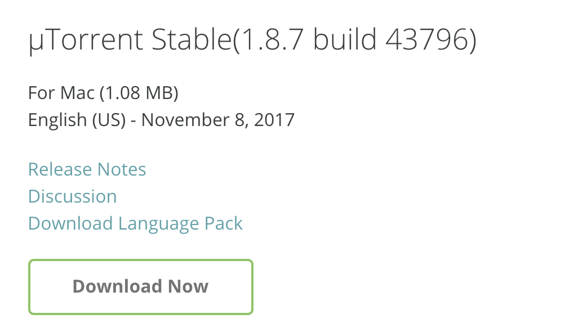
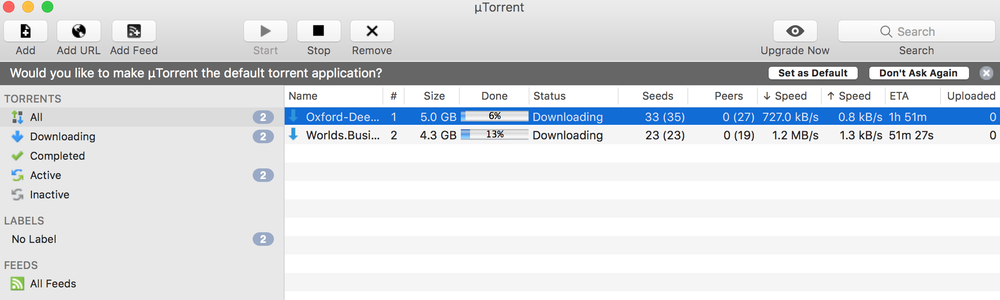
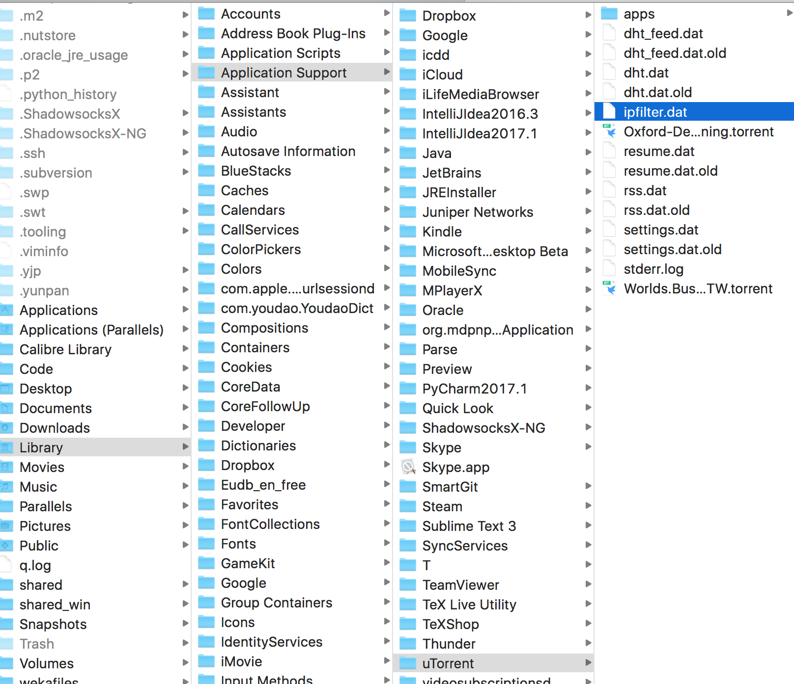
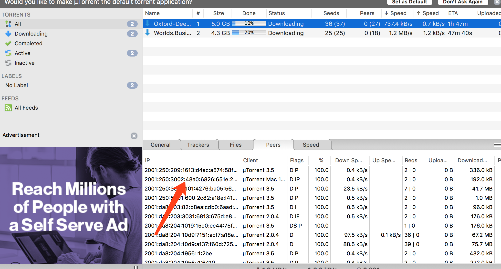

# Using uTorrent for Mac

1. Download the installer from uTorrent homepage [uTorrent](https://www.utorrent.com/intl/zh_cn/downloads/mac)

   

2. Install it, just click conitnue for several times. The you can download with uTorrent! (How to use it is easy, search online)

   

3. Setting ipv6. 

   1. Open the 'yourName'/Library/Application Support/uTorrent/ipfilter.dat

      

   2. Set the ipfilter

      0.0.0.0-255.255.255.255

   3. Check the ip -> DONE!

      
