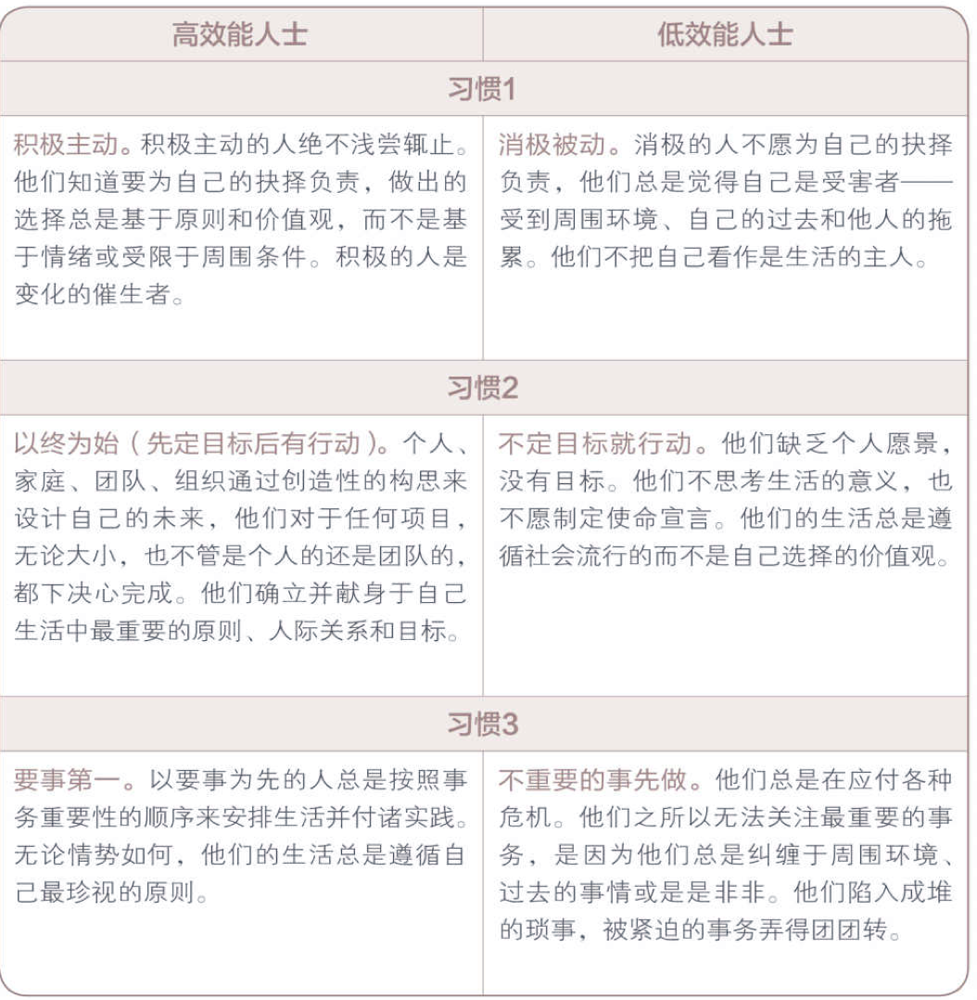
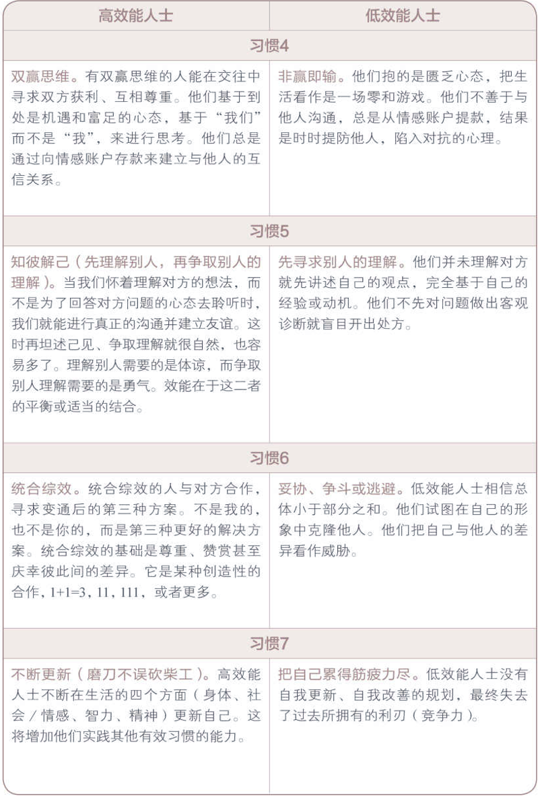

# Notes on - The seven habits of highly effective people

> [原书网址](https://www.amazon.cn/%E5%9B%BE%E4%B9%A6/dp/B007WQSGR4/ref=sr_1_1?s=books&ie=UTF8&qid=1491010853&sr=1-1&keywords=%E9%AB%98%E6%95%88%E8%83%BD%E4%BA%BA%E5%A3%AB%E7%9A%84%E4%B8%83%E4%B8%AA%E4%B9%A0%E6%83%AF)
>
> 史蒂芬•柯维. 高效能人士的七个习惯(25周年纪念版):公司员工、政府机关公务员、军队官兵装备书 (Kindle). 中国青年出版社. Kindle Edition. 

### 总揽

借用书总的一段话来总结这本书： 1 . 柯 维 在 一 套 完 整 的 理 论 体 系 中 ， 创 造 出 一 种 “ 用 户 界 面 ” ， 形 成 连 贯 的 概 念 构 架 ， 加 上 柯 维 的 文 采 ， 让 内 容 变 得 好 读 可 行 。 2 . 柯 维 的 重 点 是 跨 越 时 代 的 亘 古 不 变 的 法 则 。 而 不 仅 仅 是 一 些 技 巧 或 是 时 下 流 行 的 理 论 。 3 . 柯 维 首 先 写 的 是 “ 塑 造 性 格 ” 而 不 是 “ 获 得 成 功 ” ， 因 此 ， 不 仅 要 帮 助 人 们 变 成 高 效 能 人 士 ， 还 要 能 成 为 更 好 的 领 导 者 。 4 . 柯 维 本 身 是 大 师 级 的 教 师 ， 却 十 分 谦 虚 ， 承 认 自 己 也 有 缺 点 ， 他 立 志 要 和 大 家 分 享 所 学 到 的 知 识 。

#### 这七个习惯以及一个好的案例

首先我要 关注 我 最 喜欢 的 一个 例子—— 比尔· 盖 茨。 近几年 的 一个 潮流 是把 像 比尔· 盖 茨 这样 的 人 所获 得的 巨大 成功， 归因于 运气， 说 他们 不过 是 得益 于 天时 地利人和。 但如 果 仔细 思考， 这种 说法 就会 不攻自破。 当《 大众 电子》 杂志 把 Altair 电脑 当作 封面， 并 宣称 这是 史上 第一 台 个人 电脑 时， 比尔· 盖 茨 立刻 联合 保罗· 艾伦 组建 了 一家 软件 公司， 为 Altair 电脑 编写 BASIC 语言 程序。 也许， 盖 茨 是在 合适 的 时机 掌握 了 编程 技术， 但是 很多人 都在 学习 这个 技术， 比 如在 加 利 福 尼亚 理工 学院、 麻省 理工 学院 和 斯 坦 福 大学 学习 电脑 科学 和 电子 信息 工程 的 学生， 在 IBM、 施 乐 公司 和 惠普 这类 技术 公司 从业 的 高级 软件 工程师， 还有 政府 研究机构 的 科学家。 数以万计 的 人都 能 做到 盖 茨 所做 的， 但是 他们 没有。 盖 茨 当机立断。 他从 哈佛 辍学， 搬 到了 阿 尔 布 开 克（ Altair 电脑 的 基地 所在）。 他 夜以继日 地 编写 程序。 比尔· 盖 茨 变得 与众不同 的 原因， 并不 是在 适当 时候 做 决定 的 运气， 而是 他在 适当 时候 的 积极 回应。**（习惯一：积极主动）**

后来盖茨和妻子创办了基金会，目标就是如何用手上的资源让尽可能多的人受益。**（习惯二：以终为始）**

真 正 的 原 则 意 味 着 我 们 会 把 最 重 要 的 目 标 安 排 在 精 力 充 沛 的 时 间 ， 意 味 着 在 判 断 力 最 佳 的 状 态 下 做 出 突 破 。 “ 所 有 人 ” 几 乎 都 会 说 ， 从 哈 佛 毕 业 才 是 年 轻 的 比 尔 · 盖 茨 最 紧 要 的 任 务 。 相 反 ， 他 却 不 顾 周 围 好 心 人 质 疑 的 目 光 ， 努 力 完 成 自 己 的 目 标 。 创 建 微 软 时 ， 他 把 所 有 能 量 注 入 两 个 首 要 的 目 标 ： 雇 佣 最 好 的 员 工 ， 开 发 几 个 重 量 级 的 软 件 ； 其 余 的 事 情 都 是 次 要 的 。 盖 茨 在 一 次 晚 宴 上 第 一 次 见 到 沃 伦 · 巴 菲 特 ， 当 主 持 人 问 餐 桌 上 的 客 人 ， 认 为 人 生 旅 途 中 最 重 要 的 因 素 是 什 么 ， 盖 茨 和 巴 菲 特 不 约 而 同 地 给 出 了 相 同 的 答 案 ： “ 重 点 ” 。 **（习惯三：要是第一）**

后来在市场激烈竞争的考验下，盖茨和因特尔合作处理器、IBM或Dell合作个人电脑。注重公平，当微软获利时，员工也成功了。**（习惯四：双赢思维）（习惯六：统合综效）**

盖茨成功后，依旧带着无尽的好奇心想前进，向朋友请教。**（习惯五：知彼解己）**同时，他定期抽取时间阅读和反思。**（习惯七：不断更新）**

习 惯 一 ： 积 极 主 动 （ BE PROACTIVE ） 积 极 主 动 即 采 取 主 动 ， 为 自 己 过 去 、 现 在 及 未 来 的 行 为 负 责 ， 并 依 据 原 则 及 价 值 观 ， 而 非 情 绪 或 外 在 环 境 来 下 决 定 。 积 极 主 动 的 人 是 改 变 的 催 生 者 ， 他 们 摒 弃 被 动 的 受 害 者 角 色 ， 不 怨 天 尤 人 ， 发 挥 了 人 类 四 项 独 特 的 禀 赋 — — 自 觉 、 良 知 、 想 象 力 和 自 主 意 志 ， 同 时 以 由 内 而 外 的 方 式 来 创 造 改 变 ， 积 极 面 对 一 切 。 他 们 选 择 创 造 自 己 的 人 生 ， 这 也 是 每 个 人 最 基 本 的 决 定 。 习 惯 二 ： 以 终 为 始 （ BEGIN WITH THE END IN MIND ） 所 有 事 物 都 经 过 两 次 的 创 造 — — 先 是 在 脑 海 里 酝 酿 ， 其 次 才 是 实 质 的 创 造 。 个 人 、 家 庭 、 团 队 和 组 织 在 做 任 何 计 划 时 ， 均 先 拟 出 愿 景 和 目 标 ， 并 据 此 塑 造 未 来 ， 全 心 投 入 自 己 最 重 视 的 原 则 、 价 值 观 、 关 系 及 目 标 。 对 个 人 、 家 庭 或 组 织 而 言 ， 使 命 宣 言 可 以 说 是 愿 景 的 最 高 形 式 ， 它 是 根 本 的 决 策 ， 主 宰 了 所 有 其 他 决 定 。 领 导 工 作 的 核 心 ， 就 是 基 于 共 有 的 使 命 、 愿 景 和 价 值 观 ， 创 造 出 一 个 文 化 。 习 惯 三 ： 要 事 第 一 （ PUT FIRST THINGS FIRST ） 要 事 第 一 即 实 质 的 创 造 ， 是 梦 想 （ 你 的 目 标 、 愿 景 、 价 值 观 及 要 事 处 理 顺 序 ） 的 组 织 与 实 践 。 次 要 的 事 不 必 摆 在 第 一 ， 要 事 也 不 能 放 在 第 二 。 无 论 迫 切 性 如 何 ， 个 人 与 组 织 均 要 更 多 聚 焦 要 事 ， 重 点 是 ， 把 要 事 放 在 第 一 位 。 习 惯 四 ： 双 赢 思 维 （ THINK WIN - WIN ） 双 赢 思 维 是 一 种 基 于 互 敬 、 寻 求 互 惠 的 思 考 框 架 与 心 意 ， 目 的 是 分 享 更 多 的 机 会 、 财 富 及 资 源 ， 而 非 敌 对 式 竞 争 。 双 赢 既 非 损 人 利 己 （ 赢 输 ） ， 亦 非 损 己 利 人 （ 输 赢 ） 。 我 们 的 工 作 伙 伴 及 家 庭 成 员 要 从 互 赖 式 的 角 度 来 思 考 （ “ 我 们 ” ， 而 非 “ 我 ” ） 。 双 赢 思 维 鼓 励 我 们 解 决 问 题 ， 并 协 助 个 人 找 到 互 惠 的 解 决 办 法 ， 是 一 种 资 讯 、 力 量 、 认 可 及 报 酬 的 分 享 。 习 惯 五 ： 知 彼 解 己 （ SEEK FIRST TO UNDERSTAND , THEN TO BE UNDERSTOOD ） 当 我 们 不 再 急 切 回 答 ， 改 以 诚 心 去 了 解 、 聆 听 别 人 ， 便 能 开 启 真 正 的 沟 通 ， 增 进 彼 此 关 系 。 对 方 获 得 理 解 后 ， 会 觉 得 受 到 尊 重 与 认 可 ， 进 而 卸 下 心 理 防 备 ， 坦 然 而 谈 ， 双 方 对 彼 此 的 了 解 也 就 更 顺 畅 自 然 。 知 彼 需 要 仁 慈 心 ， 解 己 需 要 勇 气 ， 能 平 衡 两 者 ， 则 可 大 幅 提 升 沟 通 的 效 率 。 习 惯 六 ： 统 合 综 效 （ SYNERGIZE ） 统 合 综 效 谈 的 是 创 造 第 三 种 选 择 ， 即 非 按 照 我 的 方 式 ， 亦 非 遵 循 你 的 方 式 ， 而 是 创 造 第 三 种 更 好 的 办 法 。 它 是 互 相 尊 重 的 成 果 — — 不 但 了 解 了 彼 此 ， 甚 至 还 称 赞 彼 此 的 差 异 ， 欣 赏 对 方 解 决 问 题 及 把 握 机 会 的 手 法 。 个 人 的 力 量 是 团 队 和 家 庭 统 合 综 效 的 基 础 ， 能 使 整 体 获 得 一 加 一 大 于 二 的 成 效 。 实 践 统 合 综 效 的 人 际 关 系 和 团 队 会 扬 弃 敌 对 的 态 度 （ 1 + 1 ＝ 0 . 5 ） ， 不 以 妥 协 为 目 标 （ 1 + 1 ＝ 1 . 5 ） ， 也 不 仅 仅 止 于 合 作 （ 1 + 1 ＝ 2 ） ， 他 们 要 的 是 创 造 式 的 合 作 （ 1 ＋ 1 ＞ 2 ） 。 习 惯 七 ： 不 断 更 新 （ SHARPEN THE SAW ） “ 不 断 更 新 ” 谈 的 是 ， 如 何 在 四 个 生 活 基 本 面 （ 身 体 、 精 神 、 智 力 、 社 会 / 情 感 ） 中 ， 不 断 更 新 自 己 。 这 个 习 惯 提 升 了 其 他 六 个 习 惯 的 实 施 效 率 。 对 组 织 而 言 ， 习 惯 七 提 供 了 愿 景 、 更 新 及 不 断 的 改 善 ， 使 组 织 不 至 呈 现 老 化 及 疲 态 ， 并 迈 向 新 的 成 长 之 路 。 对 家 庭 而 言 ， 习 惯 七 通 过 固 定 的 个 人 及 家 庭 活 动 ， 使 家 庭 效 能 升 级 ， 就 像 建 立 传 统 ， 使 家 庭 日 新 月 异 ， 即 是 一 例 。

#### 领导力

领导力就是清晰地指出别人的价值和潜力，使对方受到鼓舞从而有所意识。

#### 变化的世界，不变的原则

我 对 生 命 的 一 种 最 深 刻 的 感 悟 就 是 ： 要 完 成 最 渴 望 的 目 标 ， 战 胜 最 艰 巨 的 挑 战 ， 你 必 须 发 掘 并 应 用 一 些 原 则 或 自 然 法 则 ， 因 为 它 们 恰 好 左 右 着 你 苦 苦 期 待 的 成 功 。 如 何 应 用 一 个 原 则 ， 因 人 而 异 ， 取 决 于 个 人 独 一 无 二 的 优 势 、 天 赋 和 创 造 力 ， 但 最 根 本 的 是 ， 任 何 努 力 的 成 功 ， 都 离 不 开 恰 到 好 处 并 游 刃 有 余 地 应 用 某 些 原 则 ， 这 些 原 则 对 成 功 而 言 是 不 可 或 缺 的。

但 一 个 不 争 的 事 实 是 ， 我 们 绝 对 不 能 无 视 平 衡 的 原 则 ， 一 方 面 ， 我 们 要 满 足 今 天 的 需 要 ， 另 一 方 面 ， 我 们 要 进 行 投 资 并 提 高 竞 争 力 ， 以 取 得 将 来 的 持 久 成 功 。

品 德 实 质 上 是 习 惯 的 合 成 。 俗 语 说 ： “ 思 想 决 定 行 动 ， 行 动 决 定 习 惯 ， 习 惯 决 定 品 德 ， 品 德 决 定 命 运 。 ”

#### 改变源于自己

谁 也 无 法 说 服 他 人 改 变 ， 因 为 我 们 每 个 人 都 守 着 一 扇 只 能 从 内 开 启 的 改 变 之 门 ， 不 论 动 之 以 情 或 晓 之 以 理 ， 我 们 都 不 能 替 别 人 开 门 。要 改 变 现 状 ， 首 先 要 改 变 自 己 ； 要 改 变 自 己 ， 先 要 改 变 我 们 对 问 题 的 看 法 。

我 们 每 个 人 脑 中 都 有 很 多 地 图 ， 可 以 分 成 两 大 类 ： 一 类 是 依 据 世 界 本 来 面 目 绘 制 的 地 图 ， 反 映 现 实 情 况 ； 另 一 类 是 依 据 思 维 定 式 绘 制 的 地 图 ， 反 映 个 人 价 值 观 。 我 们 用 这 些 地 图 诠 释 所 有 的 经 验 ， 从 来 都 不 怀 疑 地 图 的 正 确 性 ， 甚 至 意 识 不 到 它 们 的 存 在 。 我 们 理 所 当 然 地 假 定 自 己 的 所 见 所 闻 就 是 真 实 的 世 界 。

习 惯 也 一 样 有 极 大 的 引 力 ， 只 是 许 多 人 不 加 注 意 或 不 肯 承 认 罢 了 。 要 根 除 做 事 拖 沓 ， 缺 乏 耐 心 ， 吹 毛 求 疵 或 自 私 自 利 这 些 根 深 蒂 固 的 不 良 习 性 ， 仅 有 一 点 点 毅 力 ， 只 做 一 点 点 改 变 是 不 够 的 。 “ 起 飞 ” 需 要 极 大 的 努 力 ， 然 而 一 旦 脱 离 了 引 力 的 束 缚 ， 就 会 迎 来 广 阔 的 自 由 天 地 ， 创 造 出 高 效 能 生 活 所 必 需 的 凝 聚 力 和 秩 序。

改 变 习 惯 是 一 个 痛 苦 的 过 程 ， 因 为 有 了 更 高 的 目 标 才 能 激 发 改 变 ， 面 向 未 来 牺 牲 当 下 的 意 愿 才 能 促 进 改 变 。 但 是 这 又 是 幸 福 的 源 泉 ， 是 生 活 的 目 标 和 规 划 。 从 这 个 角 度 而 言 ， 幸 福 就 是 我 们 经 过 一 番 努 力 与 牺 牲 得 到 的 果 实 。

#### 效能

而 真 正 的 效 能 应 该 包 含 两 个 要 素 ： 一 是 “ 产 出 ” ， 即 金 蛋 ； 二 是 “ 产 能 ” — — 生 产 的 资 产 或 能 力 ， 即 下 金 蛋 的 鹅 。

本 金 与 利 息 就 相 当 于 产 能 与 产 出 ， 本 金 减 少 ， 产 生 利 息 的 产 能 就 减 少 ， 收 入 当 然 也 会 减 少 ， 财 产 缩 水 ， 最 后 连 起 码 的 生 活 水 平 都 无 法 维 持 。

效 能 在 于 平 衡 。 一 味 重 视 产 出 会 导 致 糟 糕 的 健 康 状 况 、 耗 损 的 机 器 设 备 、 透 支 的 银 行 存 款 或 破 裂 的 人 际 关 系 。 而 太 过 维 护 产 能 ， 就 如 同 一 个 每 天 长 跑 三 四 个 小 时 的 人 ， 宣 称 可 以 因 此 多 活 十 年 ， 却 不 知 大 好 时 光 都 在 跑 步 中 流 逝 。 又 好 像 那 些 只 知 念 书 ， 不 肯 生 产 的 人 ， 坐 享 别 人 的 金 蛋 ， 自 己 永 远 不 敢 面 对 现 实 。 唯 有 在 金 蛋 （ 产 出 ） 与 鹅 的 健 康 和 幸 福 （ 产 能 ） 之 间 取 得 平 衡 ， 才 能 实 现 真 正 的 效 能 。 虽 然 你 常 会 因 此 面 临 两 难 选 择 ， 但 这 正 是 效 能 原 则 的 精 髓 所 在 。 它 是 短 期 利 益 与 长 期 目 标 之 间 的 平 衡 ， 是 好 分 数 与 刻 苦 努 力 之 间 的 平 衡 ， 是 清 洁 的 房 间 与 良 好 的 亲 子 关 系 之 间 的 平 衡 。

### 习惯一：积极主动

选 择 的 自 由 包 括 人 类 特 有 的 四 种 天 赋 。 除 自 我 意 识 （ s e l f - a w a r e n e s s ） 外 ， 我 们 还 拥 有 “ 想 象 力 （ I m a g i n a t i o n ） ” ， 即 超 越 当 前 现 实 而 在 头 脑 中 进 行 创 造 的 能 力 ； “ 良 知 （ C o n s c i e n c e ） ” ， 即 明 辨 是 非 ， 坚 持 行 为 原 则 ， 判 断 思 想 、 言 行 正 确 与 否 的 能 力 ； “ 独 立 意 志 （ I n d e p e n d e n t W i l l ） ” ， 即 基 于 自 我 意 识 、 不 受 外 力 影 响 而 自 行 其 是 的 能 力 。

个 人 行 为 取 决 于 自 身 的 抉 择 ， 而 不 是 外 在 的 环 境 ， 人 类 应 该 有 营 造 有 利 的 外 在 环 境 的 积 极 性 和 责 任 感 。

所 有 积 极 主 动 的 人 都 深 谙 其 道 ， 因 此 不 会 把 自 己 的 行 为 归 咎 于 环 境 、 外 界 条 件 或 他 人 的 影 响 。 他 们 根 据 价 值 观 ， 有 意 识 地 选 择 待 人 接 物 的 方 式 ， 不 会 因 为 外 界 因 素 或 一 时 情 绪 而 冲 动 行 事 。

积 极 主 动 是 人 类 的 天 性 ， 即 使 生 活 受 到 了 外 界 条 件 的 制 约 ， 那 也 是 因 为 我 们 有 意 或 无 意 地 选 择 了 被 外 界 条 件 控 制 ， 这 种 选 择 称 为 消 极 被 动 （ R e a c t i v e ） 。

只 有 真 正 接 受 了 “ 我 昨 日 的 选 择 决 定 了 今 日 的 我 ” 的 观 念 ， 才 可 能 说 “ 我 有 权 另 做 选 择 ” 。

因 此 ， 伤 害 我 们 的 并 非 悲 惨 遭 遇 本 身 ， 而 是 我 们 对 于 悲 惨 遭 遇 的 回 应 。 尽 管 这 些 事 的 确 会 让 人 身 心 受 创 或 者 经 济 受 损 ， 但 是 品 德 和 本 性 完 全 可 以 不 受 影 响 。 事 实 上 越 痛 苦 的 经 历 ， 越 能 磨 炼 意 志 ， 开 发 潜 能 ， 提 升 自 如 应 对 困 境 的 能 力 ， 甚 至 还 可 能 感 召 他 人 争 取 同 样 的 自 由 。

推 卸 责 任 的 言 语 往 往 会 强 化 宿 命 论 。 说 者 一 遍 遍 被 自 己 洗 脑 ， 变 得 更 加 自 怨 自 艾 ， 怪 罪 别 人 和 环 境 ， 甚 至 把 星 座 也 扯 了 进 去 。把 外 在 环 境 视 作 问 题 症 结 的 想 法 本 身 就 成 问 题 ， 应 该 说 是 我 们 给 了 外 部 环 境 控 制 自 己 的 权 力 ， 这 种 “ 由 外 而 内 ” 求 变 的 思 维 定 式 就 是 以 外 在 环 境 改 变 作 为 个 人 改 变 的 先 决 条 件 。 积 极 的 做 法 应 该 是 “ 由 内 而 外 ” 地 改 变 ， 即 先 改 变 个 人 行 为 ， 让 自 己 变 得 更 充 实 ， 更 具 创 造 力 ， 然 后 再 去 施 加 影 响 ， 改 变 环 境 。

对 待 错 误 的 积 极 态 度 应 是 马 上 承 认 ， 改 正 并 从 中 吸 取 教 训 ， 这 样 才 能 真 正 反 败 为 胜 。 正 如 俗 语 说 “ 失 败 是 成 功 之 母 。 ”

实 际 上 伤 我 们 最 深 的 ， 既 不 是 别 人 的 所 作 所 为 ， 也 不 是 自 己 所 犯 的 错 误 ， 而 是 我 们 对 错 误 的 回 应 。 就 仿 佛 被 毒 蛇 咬 后 ， 一 心 忙 着 抓 蛇 只 会 让 毒 性 发 作 更 快 ， 倒 不 如 尽 快 设 法 排 出 毒 液 。

影 响 圈 的 核 心 就 是 做 出 承 诺 与 信 守 诺 言 的 能 力 。 积 极 主 动 的 本 质 和 最 清 晰 的 表 现 就 是 对 自 己 或 别 人 有 所 承 诺 ， 然 后 从 不 食 言 。由 此 就 找 到 了 两 种 能 够 直 接 掌 控 人 生 的 途 径 ： 一 是 做 出 承 诺 ， 并 信 守 诺 言 ； 二 是 确 立 目 标 ， 并 付 诸 实 践 。我们需要做的是关注自己的影响圈，即那些我们能左右的事情.

对 于 别 人 的 缺 点 ， 不 要 一 味 指 责 。 别 人 是 否 履 行 职 责 并 不 重 要 ， 重 要 的 是 自 己 的 态 度 。 如 果 你 一 直 认 为 问 题 “ 存 在 于 外 部 ” ， 那 么 请 马 上 打 住 ， 因 为 这 种 想 法 本 身 就 是 问 题 。 如 果 能 对 选 择 的 自 由 加 以 善 用 ， 那 么 假 以 时 日 ， 自 由 的 范 围 会 越 来 越 大 ， 反 之 就 会 越 来 越 小 ， 直 到 只 能 够 “ 被 动 生 存 ” ， 即 按 照 他 人 — — 父 母 、 同 事 和 社 会 — — 的 意 志 生 活 。 我 们 要 对 独 立 意 志 的 天 赋 善 加 利 用 ， 对 自 己 的 效 能 和 幸 福 负 责 ， 对 身 边 的 环 境 负 责 ， 这 是 后 面 每 一 个 习 惯 的 基 础 。

### 习惯二：以终为始

以 你 的 人 生 目 标 作 为 衡 量 一 切 的 标 准 ， 你 的 一 言 一 行 ， 一 举 一 动 ， 无 论 发 生 在 何 时 ， 都 必 须 遵 循 这 一 原 则 ， 即 由 个 人 最 重 视 的 期 许 或 价 值 观 来 决 定 一 切 。 牢 记 自 己 的 目 标 或 者 使 命 ， 就 能 确 信 日 常 的 所 作 所 为 并 非 与 之 南 辕 北 辙 ， 并 且 每 天 都 向 着 这 个 目 标 努 力 ， 不 敢 懈 怠 。以 终 为 始 说明 在做 任何 事 之前， 都要 先 认清 方向。 这样 不但 可以 对 目前 处境 了如指掌， 而且 不至于 在 追求 目标 的 过程中 误入歧途， 白费 工夫。头 脑 中 要 时 刻 牢 记 ： 每 天 希 望 自 己 成 为 什 么 样 的 人 ， 当 务 之 急 是 什 么 。

“ 以 终 为 始 ” 的 一 个 原 则 基 础 是 “ 任 何 事 都 是 两 次 创 造 而 成 ” 。 我 们 做 任 何 事 都 是 先 在 头 脑 中 构 思 ， 即 智 力 上 的 或 第 一 次 的 创 造 （ M e n t a l / F i r s t C r e a t i o n ） ， 然 后 付 诸 实 践 ， 即 体 力 上 的 或 第 二 次 的 创 造 （ P h y s i c a l / S e c o n d C r e a t i o n ） 。

习 惯 二 “ 以 终 为 始 ” 的 另 一 个 原 则 基 础 是 自 我 领 导 ， 但 领 导 （ L e a d e r s h i p ） 不 同 于 管 理 （ M a n a g e m e n t ） 。 领 导 是 第 一 次 的 创 造 ， 必 须 先 于 管 理 ； 管 理 是 第 二 次 的 创 造 ， 具 体 会 在 习 惯 三 中 谈 到 。

领 导 与 管 理 就 好 比 思 想 与 行 为 。 管 理 关 注 基 层 ， 思 考 的 是 “ 怎 样 才 能 有 效 地 把 事 情 做 好 ” ； 领 导 关 注 高 层 ， 思 考 的 是 “ 我 想 成 就 的 是 什 么 事 业 ” 。 用 彼 得 · 德 鲁 克 （ P e t e r D r u c k e r ） 和 华 伦 · 贝 尼

管 理 是 正 确 地 做 事 ， 领 导 则 是 做 正 确 的 事 。 

幸 好 自 我 意 识 、 想 象 力 和 良 知 帮 助 我 审 视 价 值 观 。 我 的 生 活 和 价 值 取 向 并 不 一 致 ， 因 为 我 并 没 有 按 照 积 极 主 动 的 方 式 生 活 ， 而 是 努 力 适 应 环 境 和 别 人 的 想 法 。 我 能 够 改 变 ， 不 是 靠 记 忆 而 是 按 照 理 想 而 活 ， 我 把 自 己 的 无 限 潜 力 和 有 限 的 过 去 分 开 ， 我 要 成 为 自 己 的 第 一 创 造 者 。 以 终 为 始 意 味 着 要 带 着 清 晰 的 方 向 和 价 值 观 来 扮 演 自 己 的 家 长 角 色 或 其 他 角 色 ， 要 为 自 己 人 生 的 第 一 次 创 造 负 责 ， 为 改 写 自 己 的 人 生 剧 本 负 责 ， 从 而 使 决 定 行 为 和 态 度 的 思 维 定 式 真 正 符 合 自 己 的 价 值 观 和 正 确 原 则 。 它 还 意 味 着 我 们 每 天 都 要 牢 记 这 些 价 值 观 ， 因 为 这 会 让 我 们 保 持 积 极 主 动 的 态 度 ， 以 价 值 观 为 行 动 准 则 ， 一 旦 生 活 有 变 ， 就 可 以 根 据 个 人 价 值 观 决 定 因 应 之 道 ， 无 须 受 制 于 情 绪 或 外 界 环 境 。

以 终 为 始 最 有 效 的 方 法 ， 就 是 撰 写 一 份 个 人 使 命 宣 言 ， 即 人 生 哲 学 或 基 本 信 念 。 宣 言 主 要 说 明 自 己 想 成 为 怎 样 的 人 （ 品 德 ） ， 成 就 什 么 样 的 事 业 （ 贡 献 和 成 就 ） 及 为 此 奠 基 的 价 值 观 和 原 则 。

制订 个人 使命 宣言 必须 从 影响 圈 的 核心 开始， 基本 的 思维 定式 就在 这里， 即 我们 用来 观察 世界 的“ 透镜”。当 我们 专注 于 这个 核心 并 取得 丰硕成果 的 时候， 影响 圈 就会 被 扩大， 这是 最高水平 的 产能， 会有 力 提高 我们 在 生活 各 领域 的效能。这个 核心 还是 安全感、 人生 方向、 智慧 与 力量 的 源泉。“ 安 全 感 ” （ S e c u r i t y ） 代 表 价 值 观 、 认 同 、 情 感 的 归 属 、 自 尊 自 重 与 拥 有 个 人 的 基 本 能 力 。 “ 人 生 方 向 ” （ G u i d a n c e ） 是 “ 地 图 ” 和 内 心 的 准 绳 ， 人 类 以 此 为 解 释 外 界 事 物 的 理 据 以 及 决 策 与 行 为 的 原 则 和 内 在 标 准 。 “ 智 慧 ” （ W i s d o m ） 是 人 类 对 生 命 的 认 知 、 对 平 衡 的 感 知 和 对 事 物 间 联 系 的 理 解 ， 包 括 判 断 力 、 洞 察 力 和 理 解 力 ， 是 这 些 能 力 的 统 一 体 。 “ 力 量 ” （ P o w e r ） 则 指 采 取 行 动 、 达 成 目 标 的 能 力 ， 它 是 做 出 抉 择 的 关 键 性 力 量 ， 也 包 括 培 育 更 有 效 的 习 惯 以 替 代 顽 固 旧 习 的 能 力 。 它 们 相 辅 相 成 — — 安 全 感 与 明 确 的 人 生 方 向 可 以 带 来 真 正 的 智 慧 ， 智 慧 则 能 激 发 力 量 。 若 四 者 全 面 均 衡 ， 且 协 调 发 展 ， 便 能 培 养 高 尚 的 人 格 、 平 和 的 性 格 与 完 美 的 个 体 。

以 原 则 为 中 心 的 人 会 保 持 冷 静 和 客 观 ， 不 受 情 绪 或 其 他 因 素 的 干 扰 ， 综 观 全 局 — — 工 作 需 要 、 家 庭 需 要 、 其 他 相 关 因 素 以 及 不 同 决 定 的 可 能 后 果 ， 深 思 熟 虑 后 才 做 出 正 确 的 选 择 。 拥 有 其 他 生 活 中 心 的 人 可 能 和 以 原 则 为 中 心 的 人 做 出 的 选 择 一 样 ， 都 是 赴 约 或 者 都 是 加 班 ， 但 是 后 者 的 选 择 会 有 以 下 几 项 特 征 ： 首 先 ， 这 是 主 动 的 选 择 ， 没 有 受 到 环 境 或 他 人 的 影 响 ， 是 通 盘 考 虑 后 选 择 的 最 佳 方 案 ， 是 有 意 识 的 明 智 选 择 。 其 次 ， 这 是 最 有 效 的 选 择 ， 因 为 它 基 于 原 则 ， 其 长 期 后 果 可 以 预 料 。 再 次 ， 这 是 根 据 原 则 所 做 出 的 选 择 ， 能 提 高 自 身 的 价 值 。 为 了 报 复 他 人 而 决 定 加 班 或 者 为 了 公 司 利 益 而 加 班 的 结 果 虽 然 相 同 ， 但 意 义 却 大 相 径 庭 。 践 行 这 个 决 定 的 过 程 有 助 于 从 整 体 上 提 高 你 的 生 活 质 量 和 意 义 。 再 次 ， 若 平 时 已 与 配 偶 和 老 板 建 立 了 良 好 的 相 互 依 赖 关 系 ， 此 时 就 不 难 向 他 们 解 释 如 此 决 定 的 理 由 ， 而 且 也 会 得 到 体 谅 。 因 为 已 经 实 现 了 独 立 ， 所 以 可 以 选 择 有 效 的 相 互 依 赖 ， 可 以 授 权 他 人 完 成 部 分 任 务 ， 剩 下 的 等 自 己 第 二 天 一 早 来 完 成 。 最 后 ， 对 自 己 的 选 择 胸 有 成 竹 ， 无 论 结 果 怎 样 ， 都 能 专 注 于 此 ， 并 且 心 安 理 得 ， 内 心 没 有 羁 绊 。

### 习惯三：

### 习惯四：

### 习惯五：

### 习惯六：

### 习惯七：

### 总结

